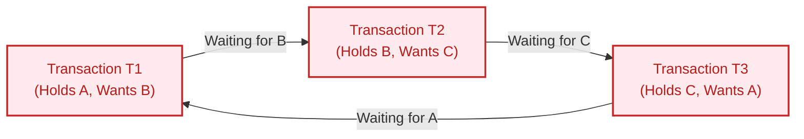
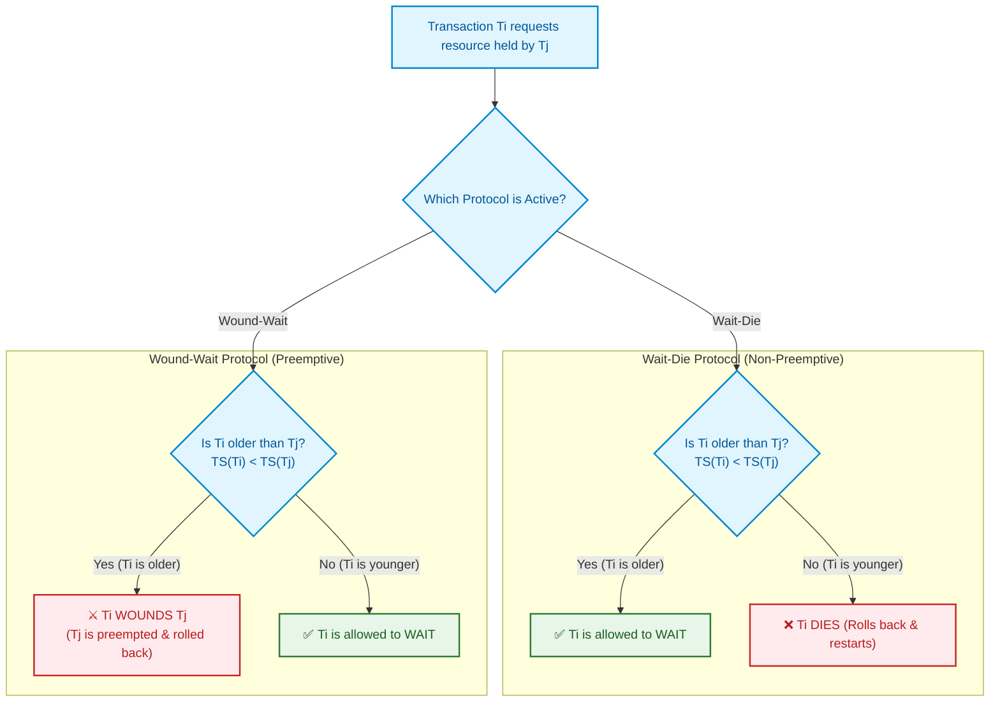

import CoreDoseLessonHeader from '@site/src/components/CoreDose/CoreDoseLessonHeader';
import CoreDoseTOC from '@site/src/components/CoreDose/CoreDoseTOC';
import CoreDoseNav from '@site/src/components/CoreDose/CoreDoseNav';

# Deadlock Handling: Wait-Die vs. Wound-Wait Protocols

<CoreDoseLessonHeader />

## 💡 Core Intuition

### 🍳 The Everyday Analogy: The Single-Track Railroad Bridge

Imagine two heavy freight trains approaching a single-track mountain bridge from opposite directions:
- Train A moves onto the bridge track, but needs the signal switch on the far side ($B$).
- Train B moves onto the other end of the track, but needs the signal switch on Train A's side ($A$).

Neither engineer can move forward; neither can back up without derailment. They sit on the bridge blowing their horns forever. This is a **Deadlock**: two or more processes trapped in an indefinite wait state, each holding a lock the other requires.

To resolve this dilemma, railroads implement two distinct policies:
1. **The Seniority Patience Rule (Wait-Die):** If an older, high-priority transcontinental express meets a local switcher train, the express is allowed to patiently wait. But if a young switcher arrives late and blocks an older express, the young switcher is immediately instructed to back off the track and clear the line (it "dies").
2. **The Aggressive Seniority Rule (Wound-Wait):** An older express doesn't wait for anyone! When it encounters a younger switcher holding the track, it aggressively commands the switcher to reverse into a siding immediately (it "wounds" it). Meanwhile, younger switchers must wait quietly for older expresses.

### 💻 Bridging to Computer Science

Because Two-Phase Locking (2PL) allows concurrent transactions to request locks incrementally during their growing phase, deadlocks are mathematically inevitable under high contention.

Database management systems handle deadlocks through two fundamental architectural strategies:
1. **Deadlock Detection & Recovery:** Allow deadlocks to occur, detect cycles in a dynamic **Wait-For Graph (WFG)**, and abort a chosen victim transaction.
2. **Deadlock Prevention (Timestamp Schemes):** Use transaction inception timestamps to preemptively decide whether a transaction waits or aborts, guaranteeing that cycles can **never form in the first place**.

---

<CoreDoseTOC toc={toc} />

---

## 📚 Core Deep-Dive & Concepts

### What is a Database Deadlock?

**Definition:** A **Deadlock** is a state in which two or more transactions are in a simultaneous, permanent wait state because each transaction holds a lock on a resource that another transaction in the cycle is requesting.

```
Transaction T1: Holds Lock on A  --->  Requests Lock on B (Held by T2)
Transaction T2: Holds Lock on B  --->  Requests Lock on A (Held by T1)
```

Neither transaction can release its locks (because under 2PL, they are in their growing phase and require both locks to make progress). Without external intervention, both transactions remain blocked indefinitely.

---

### Strategy 1: Deadlock Detection & The Wait-For Graph (WFG)

When a database system allows transactions to wait indefinitely without prevention protocols, it must run a background **Deadlock Detection** engine at periodic intervals (e.g. every $500\text{ ms}$).

#### The Wait-For Graph (WFG)
The Wait-For Graph is a directed graph $G = (V, E)$ maintained by the lock manager:
- **Vertices ($V$):** The set of all currently active transactions in the database system.
- **Directed Edges ($E$):** A directed edge $T_i \to T_j$ exists if and only if transaction $T_i$ is currently blocked waiting for transaction $T_j$ to release a lock on a data item.



> **The Deadlock Detection Theorem:** A system deadlock exists if and only if the Wait-For Graph contains a **directed cycle**.

#### Deadlock Recovery: Victim Selection
Once a cycle is detected, the DBMS breaks the deadlock by selecting one transaction in the cycle to **abort (rollback)**:

1. **Victim Selection Metrics:**
   - **Work Completed:** Abort the transaction that has executed the fewest instructions or written the fewest log blocks.
   - **Lock Footprint:** Abort the transaction holding the fewest locks to minimize cascade effects.
   - **Cost of Rollback:** Abort the transaction with the smallest undo footprint.
2. **Rollback Extent:**
   - **Total Rollback:** Completely abort the transaction and restart it from the beginning.
   - **Partial Rollback (Savepoints):** Roll back the transaction only as far as necessary to break the specific lock cycle.
3. **Starvation Prevention:** If the victim selection algorithm repeatedly picks the same long-running transaction, the transaction starves. The DBMS increments a retry counter for each abort, granting higher priority to frequently aborted transactions.

---

### Strategy 2: Deadlock Prevention via Timestamp Protocols

Deadlock prevention algorithms evaluate lock requests dynamically using transaction creation timestamps $TS(T_i)$.

- When transaction $T_i$ enters the system, the clock assigns a unique, immutable timestamp $TS(T_i)$.
- If $TS(T_1) < TS(T_2)$, then **$T_1$ is older (senior)** and **$T_2$ is younger (junior)**.
- Timestamps create a natural strict ordering, preventing cyclic dependency loops.

There are two canonical timestamp-based deadlock prevention protocols:

---

### Protocol 1: The Wait-Die Scheme (Non-Preemptive)

In the **Wait-Die** scheme, locks are non-preemptive: an older transaction can never forcefully terminate a younger transaction.

Suppose transaction $T_i$ requests a data item currently locked by transaction $T_j$:

| Scenario | Condition | Action Taken | Rationale |
| :--- | :---: | :---: | :--- |
| **Older requests Younger** | $TS(T_i) < TS(T_j)$ | **$T_i$ is allowed to WAIT** | The older transaction is given patience to wait for the younger to finish. |
| **Younger requests Older** | $TS(T_i) > TS(T_j)$ | **$T_i$ DIES (Rolls back)** | The younger transaction is immediately aborted and restarted. |

> **Wait-Die Mnemonic:** *"Old Waits, Young Dies"*

```
Ti (Old) requests lock held by Tj (Young)  ===>  Ti Waits
Ti (Young) requests lock held by Tj (Old)  ===>  Ti Dies (Aborts)
```

In Wait-Die, directed edges in the dependency graph can only flow from older transactions to younger transactions ($T_{\text{old}} \to T_{\text{young}}$). Because timestamps strictly decrease along every path, a cycle is mathematically impossible!

---

### Protocol 2: The Wound-Wait Scheme (Preemptive)

In the **Wound-Wait** scheme, locks are preemptive: an older transaction aggressively takes what it needs by preempting younger transactions.

Suppose transaction $T_i$ requests a data item currently locked by transaction $T_j$:

| Scenario | Condition | Action Taken | Rationale |
| :--- | :---: | :---: | :--- |
| **Older requests Younger** | $TS(T_i) < TS(T_j)$ | **$T_i$ WOUNDS $T_j$ ($T_j$ Aborts)** | The older transaction preempts the lock, forcing the younger $T_j$ to roll back immediately. |
| **Younger requests Older** | $TS(T_i) > TS(T_j)$ | **$T_i$ is allowed to WAIT** | The younger transaction waits for the senior $T_j$ to complete. |

> **Wound-Wait Mnemonic:** *"Old Wounds, Young Waits"*

```
Ti (Old) requests lock held by Tj (Young)  ===>  Tj is Wounded (Aborted)
Ti (Young) requests lock held by Tj (Old)  ===>  Ti Waits
```

In Wound-Wait, directed edges can only flow from younger transactions to older transactions ($T_{\text{young}} \to T_{\text{old}}$). Because timestamps strictly increase along every path, cycles cannot form.

---

### Wait-Die vs. Wound-Wait: Engineering Comparison

| Architectural Dimension | **Wait-Die Scheme** | **Wound-Wait Scheme** |
| :--- | :--- | :--- |
| **Preemption Model** | Non-preemptive (Locks never revoked forcefully) | **Preemptive** (Older transactions forcibly abort younger) |
| **Number of Rollbacks** | **Significantly Higher** (Young transactions repeatedly die) | **Significantly Lower** (Older transactions finish quickly) |
| **Transaction Waiting Time** | Longer for older transactions | Minimal for older transactions |
| **Starvation Prevention** | Guarantees freedom from starvation | Guarantees freedom from starvation |
| **Production Preference** | Rarely used due to restart thrashing | Widely used in distributed engines (e.g., Spanner) |

#### How Both Schemes Prevent Starvation
When a transaction is aborted (whether it "dies" in Wait-Die or is "wounded" in Wound-Wait), the DBMS **preserves its original inception timestamp upon restart**.

As other transactions enter the system, the aborted transaction becomes progressively older relative to the rest of the database. Eventually, it becomes the oldest transaction in the system, after which it can never be killed or wounded again, guaranteeing completion.

---

## 📐 Architecture / Visual Blueprint

The following decision flow contrasts how Wait-Die and Wound-Wait arbitrate a lock conflict when $T_i$ requests a resource held by $T_j$:



---

## 🏭 In The Real World: Production Case Study

### Distributed Deadlock Resolution in Google Cloud Spanner

Google Cloud Spanner processes distributed transactions globally across thousands of nodes using TrueTime and multi-Paxos replication.

#### The Distributed Deadlock Problem
In a globally distributed database, constructing a centralized Wait-For Graph requires querying lock tables across continents (e.g. from Tokyo to Virginia). Network latency ($150\text{ ms}$) would make graph cycle detection unacceptably slow, creating massive lock queuing.

#### The Spanner Solution: Wound-Wait via TrueTime
Instead of building distributed Wait-For Graphs, Spanner implements the **Wound-Wait deadlock prevention protocol** powered by atomic hardware clocks (TrueTime):
1. Every transaction receives a monotonically increasing TrueTime commit timestamp upon start.
2. If an older transaction $T_{\text{senior}}$ arrives at a Paxos group and finds a lock held by a younger transaction $T_{\text{junior}}$, Spanner immediately issues a preemption abort:
   $$\text{Wound}(T_{\text{junior}})$$
3. $T_{\text{junior}}$ yields its locks and restarts with its original timestamp, while $T_{\text{senior}}$ executes without waiting on cross-datacenter coordination.
4. If a younger transaction requests a lock held by an older transaction, it waits locally.

By using Wound-Wait, Spanner guarantees **100% mathematical freedom from distributed deadlocks** without exchanging a single cycle-detection message across regions.

---

## 🎯 Exam & Interview Pitfall Check

:::tip Core Conceptual Questions

**Question 1:** Transaction $T_1$ entered the database at timestamp $10$, and transaction $T_2$ entered at timestamp $25$. Suppose $T_2$ requests a lock held by $T_1$. What occurs under:
1. The Wait-Die scheme?
2. The Wound-Wait scheme?

**Answer:**
Here, $TS(T_1) = 10$ and $TS(T_2) = 25$. Therefore, $T_1$ is older and $T_2$ is younger.
The requesting transaction is $T_2$ (younger), and the holding transaction is $T_1$ (older).
1. **Under Wait-Die:**
   Younger requests older $\implies$ **$T_2$ DIES** (rolls back and restarts with original timestamp $25$).
2. **Under Wound-Wait:**
   Younger requests older $\implies$ **$T_2$ is allowed to WAIT** until $T_1$ completes and releases the lock.

---

**Question 2:** Why must a rolled-back transaction keep its original timestamp upon restarting in both Wait-Die and Wound-Wait protocols?

**Answer:**
If an aborted transaction were assigned a new (current) timestamp upon restart, it would continually be labeled as the "youngest" transaction in the system. Under high contention, it would repeatedly be aborted by older transactions, resulting in **Starvation (Livelock)**. By retaining its original timestamp, the transaction gets progressively older relative to new transactions entering the system. Eventually, its timestamp becomes smaller than all other active transactions, guaranteeing it will never be aborted or killed again, thus ensuring starvation freedom.

:::

:::warning Common Interview Traps

**Trap 1: Assuming that "Wound-Wait" always kills the holding transaction immediately.**
In Wound-Wait, if $T_i$ is older and requests a lock held by $T_j$, $T_i$ wounds $T_j$. However, if $T_j$ has already entered the commit phase (is partially committed and flushing WAL), the DBMS does not abort $T_j$; instead, it lets $T_j$ finish committing, and $T_i$ waits briefly.

**Trap 2: Thinking that Deadlock Prevention has no overhead.**
While deadlock prevention eliminates the need for Wait-For Graph cycle detection, it introduces substantial **transaction restart overhead**. Under high lock contention, transactions are frequently aborted and rolled back prematurely, consuming CPU cycles and client network connections.

:::

---

<CoreDoseNav
  prev={{
    title: "Two-Phase Locking Protocol (2PL): Basic, Strict & Rigorous",
    url: "/coredose/dbms/chapter-08/two-phase-locking-protocol-2pl"
  }}
  next={{
    title: "Timestamp Ordering Protocol & Thomas Write Rule",
    url: "/coredose/dbms/chapter-08/timestamp-ordering-and-thomas-write-rule"
  }}
  courseUrl="/coredose/dbms"
/>
