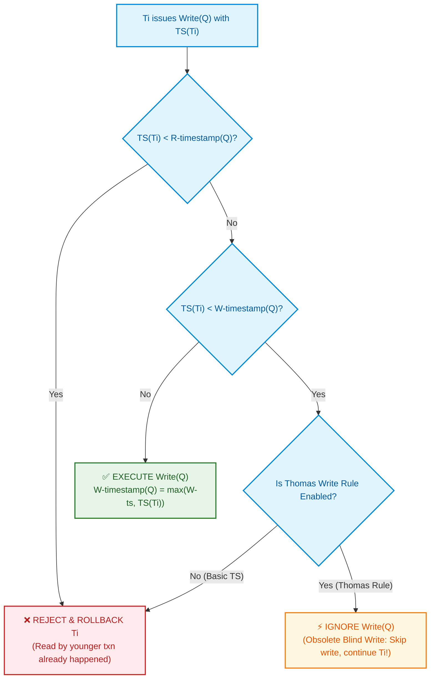

import CoreDoseLessonHeader from '@site/src/components/CoreDose/CoreDoseLessonHeader';
import CoreDoseTOC from '@site/src/components/CoreDose/CoreDoseTOC';
import CoreDoseNav from '@site/src/components/CoreDose/CoreDoseNav';

# Timestamp Ordering Protocol & Thomas Write Rule

<CoreDoseLessonHeader />

## 💡 Core Intuition

### 🍳 The Everyday Analogy: The Chronological Mail Sorting Office

Imagine a postal sorting facility where every letter is stamped with an atomic timestamp as it enters the front door:
- An elderly courier ($T_{\text{old}}$, Timestamp $10:00\text{ AM}$) walks in with a revised address for a package.
- But looking at the package delivery log, the clerk notices that a young messenger ($T_{\text{young}}$, Timestamp $10:30\text{ AM}$) has already picked up the package and shipped it out ($R(Q)$)!
- The elderly courier is too late: their update arrived out of chronological order. Under strict protocol rules, the old letter is rejected and shredded.

Now, consider a different scenario:
- The young messenger ($T_{\text{young}}$, Timestamp $10:30\text{ AM}$) painted the shipping crate bright blue ($W(Q)$).
- A few minutes later, the elderly courier ($T_{\text{old}}$, Timestamp $10:00\text{ AM}$) arrives with a can of yellow paint intending to paint the crate yellow ($W(Q)$).

Under strict rules, the clerk would scream and abort the old courier. But an astute clerk named **Thomas** observes: "Wait! The crate is already blue, and the blue paint was ordered at $10:30\text{ AM}$. Even if we had painted it yellow at $10:00\text{ AM}$, it would have been repainted blue 30 minutes later anyway! Let's just **quietly ignore the yellow paint** and let the courier go home successfully." 

This common-sense optimization is **Thomas' Write Rule**: obsolete blind writes are harmlessly ignored, boosting performance without corrupting the final view.

### 💻 Bridging to Computer Science

Unlike Two-Phase Locking (which uses locks and dynamic blocking), the **Timestamp Ordering Protocol** is an **optimistic/non-locking** concurrency protocol. 

It predetermines the serialization order before transactions execute:
$$\text{Serialization Order } \equiv \text{Chronological Inception Timestamp } TS(T_i)$$

```
Transaction Inception  --->  Assigned Monotonic Timestamp TS(Ti)
Item Q maintains:     --->  W-timestamp(Q) and R-timestamp(Q)
```

Because transactions never wait for locks, **deadlocks are mathematically impossible**. If an operation arrives out of order, the transaction is immediately rolled back and restarted.

---

<CoreDoseTOC toc={toc} />

---

## 📚 Core Deep-Dive & Concepts

### Timestamps for Transactions & Data Items

#### 1. Transaction Timestamp $TS(T_i)$
When transaction $T_i$ enters the system, the DBMS assigns it a unique, immutable timestamp:
- Generated using the system clock or a monotonic logical counter.
- If $T_1$ enters before $T_2$, then $TS(T_1) < TS(T_2)$ ($T_1$ is older, $T_2$ is younger).
- The timestamp remains **fixed throughout the transaction's lifetime**.

#### 2. Data Item Timestamps
Every data item $Q$ in the database maintains two dynamic tracking timestamps:
- **$\text{W-timestamp}(Q)$:** The largest timestamp of any transaction that successfully executed a write operation $\text{Write}(Q)$.
- **$\text{R-timestamp}(Q)$:** The largest timestamp of any transaction that successfully executed a read operation $\text{Read}(Q)$.

Whenever a transaction successfully reads or writes $Q$, the respective timestamp is updated to the maximum of its existing value and $TS(T_i)$.

---

### The Basic Timestamp Ordering Protocol Rules

Whenever transaction $T_i$ issues a read or write request on data item $Q$:

#### Read Protocol: $T_i$ issues $\text{Read}(Q)$

```
                TS(Ti) < W-timestamp(Q) ?
                       /         \
                     YES          NO
                     /              \
         [ REJECT & ROLLBACK Ti ]    [ EXECUTE Read(Q) ]
                                     R-timestamp(Q) = max(R-timestamp(Q), TS(Ti))
```

1. **If $TS(T_i) < \text{W-timestamp}(Q)$:**
   A younger transaction (with timestamp $> TS(T_i)$) has already overwritten $Q$. Transaction $T_i$ needs to read an older, overwritten value that has vanished.
   $\implies$ **Reject the read operation and ROLL BACK $T_i$!**
2. **If $TS(T_i) \ge \text{W-timestamp}(Q)$:**
   The write on $Q$ occurred before $T_i$'s logical time.
   $\implies$ **Execute $\text{Read}(Q)$ successfully**, and update:
   $$\text{R-timestamp}(Q) = \max\left(\text{R-timestamp}(Q), \, TS(T_i)\right)$$

---

#### Write Protocol: $T_i$ issues $\text{Write}(Q)$

1. **If $TS(T_i) < \text{R-timestamp}(Q)$:**
   A younger transaction has already read the value of $Q$ under the assumption that $T_i$'s write would never happen.
   $\implies$ **Reject the write operation and ROLL BACK $T_i$!**
2. **If $TS(T_i) < \text{W-timestamp}(Q)$:**
   A younger transaction has already overwritten $Q$ with a newer value. $T_i$ is attempting to write an obsolete value.
   $\implies$ **Reject the write operation and ROLL BACK $T_i$!** (Under Basic Timestamping).
3. **Otherwise ($TS(T_i) \ge \text{R-timestamp}(Q)$ AND $TS(T_i) \ge \text{W-timestamp}(Q)$):**
   $\implies$ **Execute $\text{Write}(Q)$ successfully**, and update:
   $$\text{W-timestamp}(Q) = \max\left(\text{W-timestamp}(Q), \, TS(T_i)\right)$$

---

### Thomas' Write Rule: Optimizing Obsolete Blind Writes

In 1979, Robert H. Thomas observed that Condition 2 of the basic write protocol is overly restrictive. 

**Definition:** **Thomas' Write Rule** is a modified timestamp ordering protocol that optimizes handling of **obsolete blind writes**:

$$\text{When } T_i \text{ attempts } \text{Write}(Q) \text{ and } \mathbf{TS(T_i) < \text{W-timestamp}(Q)}:$$

> **The Thomas Write Directive:** Instead of rejecting the write and aborting $T_i$, **SIMPLY IGNORE THE WRITE OPERATION AND PROCEED!**

#### Why Ignoring the Write is Correct
1. Because $TS(T_i) < \text{W-timestamp}(Q)$, a younger transaction $T_j$ has already written to $Q$.
2. Because $TS(T_i) \ge \text{R-timestamp}(Q)$, no active transaction needed to read $T_i$'s intermediate write value.
3. Therefore, $T_i$'s write is an obsolete intermediate value that would have been overwritten immediately by $T_j$ anyway.
4. By silently dropping $T_i$'s write, the final state of $Q$ remains identical to the state produced by $T_j$.

#### Serializability Impact
- Basic Timestamp Ordering guarantees **Conflict Serializability**.
- Thomas' Write Rule allows schedules that violate conflict order, but guarantees **View Serializability**!

---

### The Master Concurrency Control Comparison Matrix

The following table synthesizes the fundamental properties of all major database concurrency control protocols:

| Concurrency Protocol | Conflict Serializable? | View Serializable? | Recoverable by Default? | Cascadeless (ACA)? | Deadlock Free? |
| :--- | :---: | :---: | :---: | :---: | :---: |
| **Basic Timestamp Protocol** | ✅ **Yes** | ✅ **Yes** | ❌ No | ❌ No | ✅ **Yes** |
| **Thomas Write Rule** | ❌ **No** | ✅ **Yes** | ❌ No | ❌ No | ✅ **Yes** |
| **Basic 2PL** | ✅ **Yes** | ✅ **Yes** | ❌ No | ❌ No | ❌ **No** |
| **Conservative 2PL** | ✅ **Yes** | ✅ **Yes** | ❌ No | ❌ No | ✅ **Yes** |
| **Strict 2PL** | ✅ **Yes** | ✅ **Yes** | ✅ **Yes** | ✅ **Yes** | ❌ **No** |
| **Rigorous 2PL** | ✅ **Yes** | ✅ **Yes** | ✅ **Yes** | ✅ **Yes** | ❌ **No** |

---

## 📐 Architecture / Visual Blueprint

The following decision flowchart illustrates how a write request $\text{Write}(Q)$ is processed under Basic Timestamping versus Thomas' Write Rule:



---

## 🏭 In The Real World: Production Case Study

### Distributed Key-Value Store: Apache Cassandra & ScyllaDB

NoSQL distributed databases like Apache Cassandra, ScyllaDB, and DynamoDB handle petabytes of writes per second using **Last-Write-Wins (LWW)** conflict resolution—a direct industrial application of Thomas' Write Rule.

#### The LWW Production Scenario
In globally distributed Cassandra clusters spanning multi-region datacenters:
1. Client A updates user email: `UPDATE users SET email = 'alice@new.com'` at timestamp $T = 100$.
2. Due to WAN network congestion, Client A's packet is delayed in transit.
3. Client B updates the same user email: `UPDATE users SET email = 'alice@final.com'` at timestamp $T = 105$.
4. Node 1 receives Client B's write first ($W\text{-ts} = 105$) and commits the record.
5. Three seconds later, Client A's delayed packet ($TS = 100$) finally arrives at Node 1.

#### How Thomas' Write Rule Prevents Data Regression
Under locking protocols, the node would have to acquire distributed locks or reject the connection. 
Instead, Cassandra evaluates Thomas' Write Rule:
$$TS(\text{Packet A}) = 100 < W\text{-timestamp}(\text{Record}) = 105$$
Cassandra **silently discards the obsolete write payload**. It acknowledges the write as successful without modifying the disk block, ensuring that older out-of-order network packets never overwrite newer committed data.

---

## 🎯 Exam & Interview Pitfall Check

:::tip Core Conceptual Questions

**Question 1:** Explain why the Timestamp Ordering Protocol is inherently free from deadlocks.

**Answer:**
A deadlock requires transactions to be trapped in a circular waiting dependency ($\text{Wait-For}$ cycle). 
In the Timestamp Ordering Protocol, **transactions never wait for resources**. When an operation is requested:
- If the operation is chronologically valid with respect to data timestamps, it is executed immediately.
- If the operation is out of order, the requesting transaction is **immediately rejected and rolled back**.

Because there is zero waiting, directed wait edges cannot form, rendering deadlocks mathematically impossible.

---

**Question 2:** Why is a schedule generated by Thomas' Write Rule view serializable, even if it is not conflict serializable?

**Answer:**
Thomas' Write Rule permits an obsolete write ($TS(T_i) < \text{W-timestamp}(Q)$) to be safely ignored because a younger transaction $T_j$ ($TS(T_j) > TS(T_i)$) has already overwritten the data item, and no transaction read $T_i$'s intermediate write value. 
In the conflict precedence graph, skipping the write inverts the expected write-write conflict edge, creating a cycle. However, in terms of **View Equivalence**:
- Initial reads are preserved.
- Data flows (updated reads) are preserved.
- The final write is still executed by the younger transaction $T_j$.

Because all three view invariants remain identical to the serial timestamp order, the schedule is strictly View Serializable.

:::

:::warning Common Interview Traps

**Trap 1: Believing that Timestamp Ordering eliminates all concurrency overhead.**
While Timestamp Ordering avoids locking and deadlocks, it can suffer from severe **Starvation (Livelock)** under high write contention. Long-running transactions are repeatedly aborted and restarted whenever newer short transactions update timestamps ahead of them.

**Trap 2: Assuming Thomas' Write Rule ignores reads as well.**
Thomas' Write Rule applies **exclusively to Write operations** where $TS(T_i) < \text{W-timestamp}(Q)$. It does **not** ignore out-of-order read operations ($TS(T_i) < \text{W-timestamp}(Q)$). An obsolete read must always cause a transaction rollback to prevent reading dirty or fabricated data.

:::

---

<CoreDoseNav
  prev={{
    title: "Deadlock Handling: Wait-Die vs. Wound-Wait Protocols",
    url: "/coredose/dbms/chapter-08/deadlock-handling-wait-die-vs-wound-wait"
  }}
  next={{
    title: "File Organizations: Heap, Sorted & Hashed Files",
    url: "/coredose/dbms/chapter-09/file-organizations-heap-sorted-hash"
  }}
  courseUrl="/coredose/dbms"
/>
