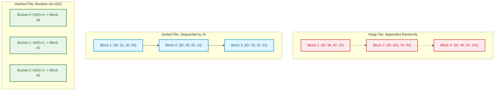

import CoreDoseLessonHeader from '@site/src/components/CoreDose/CoreDoseLessonHeader';
import CoreDoseTOC from '@site/src/components/CoreDose/CoreDoseTOC';
import CoreDoseNav from '@site/src/components/CoreDose/CoreDoseNav';

# File Organizations: Heap, Sorted & Hashed Files

<CoreDoseLessonHeader />

## 💡 Core Intuition

### 🍳 The Everyday Analogy: The Warehouse Storage Systems

Imagine managing a physical archive of $30,000$ paper project folders inside a massive warehouse:
1. **The Pile System (Heap File):** Every time a new project folder arrives, you walk to the very back of the warehouse and toss it on top of the newest stack. Filing takes 5 seconds ($O(1)$). But when the CEO asks for "Project Falcon", you must physically walk through every single box from front to back, examining folders one by one ($O(n)$ search).
2. **The Alphabetical Shelving System (Sorted File):** Every project is filed in strict alphabetical order by project code. Finding "Project Falcon" is lightning fast: you jump to the middle aisle (`M`), realize `F` is in the first half, jump to `F`, and find it in seconds using **Binary Search** ($O(\log n)$). However, when a new project "Project Fixer" arrives, you cannot just drop it in: you must physically push thousands of heavy boxes to the right to make space for one folder.
3. **The Hash Box System (Hashed File):** You run the project code through a math formula (e.g. sum of letters modulo 100) that directly spits out the exact aisle and shelf number. You walk straight to that shelf in $O(1)$ time.

In database physical storage, disk drives read data in fixed-size **Blocks** (pages). How records are arranged across these blocks dictates whether queries finish in milliseconds or stall for hours.

### 💻 Bridging to Computer Science

Theoretically, relational databases are founded on set theory, where tuple order inside a relation is mathematically irrelevant. But in physical database implementation, **storage order is everything**.

```
Physical Storage Organization:
  ├── Unordered (Heap File)       ===> Fast Appends O(1), Slow Scans O(b)
  ├── Ordered (Sorted File)      ===> Fast Binary Search O(log2 b), Expensive Shifts
  └── Hash File Organization     ===> O(1) Direct Key Lookup, Inefficient Range Scans
```

Every query execution plan generated by the database optimizer begins by estimating the number of **Block Transfers (Disk I/Os)** required by the underlying file organization.

---

<CoreDoseTOC toc={toc} />

---

## 📚 Core Deep-Dive & Concepts

### Physical Storage Primitives: Records, Blocks, and Blocking Factor

Database tables are stored physically as collections of fixed-length or variable-length **records** packed into fixed-size storage units called **disk blocks (pages)** (typically $1\text{ KB}, 4\text{ KB}, 8\text{ KB},$ or $16\text{ KB}$).

#### 1. Blocking Factor ($Bfr$)
The number of physical records that can fit completely inside a single disk block:
$$Bfr = \left\lfloor \frac{\text{Block Size } (B)}{\text{Record Length } (R)} \right\rfloor$$
*(Where $\lfloor \dots \rfloor$ represents the floor function for unspanned records).*

#### 2. Number of Data Blocks ($b$)
The total number of physical disk blocks required to store $r$ records:
$$b = \left\lceil \frac{\text{Total Records } (r)}{\text{Blocking Factor } (Bfr)} \right\rceil$$

---

### Unordered (Heap) File Organization

In a **Heap File**, records are inserted in the order they arrive, appended directly to the end of the last data block in the file.

#### Operational Characteristics
- **Insertion:** Extremely fast. If the last block has free space, the record is written in $O(1)$ block I/O. If full, allocate a new block and append.
- **Search (Equality):** Requires a sequential **Linear Scan**. On average, the DBMS must search half the blocks if the record is present:
  $$\text{Average Search Cost} = \frac{b}{2} \text{ block transfers}$$
  If searching for a non-unique attribute or a record that does not exist, the DBMS must read **all $b$ blocks**:
  $$\text{Worst-Case Search Cost} = b \text{ block transfers}$$
- **Deletion:** Locate the block containing the target record, set a deletion tombstone flag, and write the block back ($b_{\text{search}} + 1$). Periodic vacuuming reorganizes space.

---

### Ordered (Sequential / Sorted) File Organization

In an **Ordered File**, records are physically sorted on disk based on the value of a specific field, termed the **Ordering Field** (or **Ordering Key** if unique).

#### Operational Characteristics
- **Search (Equality on Ordering Key):** Because records are sorted physically across blocks, the DBMS executes **Binary Search** over the block directory:
  $$\text{Search Cost} = \lceil \log_2(b) \rceil \text{ block transfers}$$
- **Range Queries:** Exceptionally efficient. Locate the first matching record via binary search, then scan contiguous blocks sequentially until the range boundary is reached.
- **Insertion:** Highly expensive! Inserting a record into its correct alphabetical/numeric position requires finding the target block and shifting subsequent records across multiple blocks to free space. DBMS engines often mitigate this using **Overflow Blocks** chained with pointers.
- **Deletion:** Fast with tombstone markers; physical compaction requires block shifting.

---

### Hashed File Organization

In a **Hashed File**, records are assigned to disk blocks (called **buckets**) based on a mathematical hash function $h(K)$ applied to the search key:
$$\text{Bucket Address} = h(K) \pmod M$$

#### Operational Characteristics
- **Search (Equality on Hash Key):** Compute $h(K)$, jump directly to the target bucket block:
  $$\text{Average Search Cost} \approx 1 \text{ block transfer (assuming zero collision)}$$
- **Collision Handling:** When a bucket overflows, the DBMS chains an **overflow block** via a linked list, degrading search to $1 + \text{chain length}$.
- **Range Queries:** **Extremely Poor!** A hash function deliberately randomizes data distribution. Executing `WHERE age BETWEEN 20 AND 30` requires a complete full table scan of all blocks ($b$ I/Os).

---

### File Organization Trade-Off Matrix

| Dimension | Heap File | Ordered (Sorted) File | Hashed File |
| :--- | :--- | :--- | :--- |
| **Record Physical Order** | Random (Arrival order) | Sorted on Ordering Field | Grouped into Hash Buckets |
| **Equality Search Cost** | $O(b)$ linear scan | $O(\log_2 b)$ binary search | $O(1)$ direct bucket read |
| **Range Query Cost** | $O(b)$ full scan | $O(\log_2 b + \text{range})$ contiguous | $O(b)$ full scan (randomized keys) |
| **Insertion Cost** | $O(1)$ fast append | $O(b)$ block shifting | $O(1)$ bucket write |
| **Best Used For** | Bulk logging, staging tables | Analytical tables, range queries | Fast single-row primary key lookups |

---

### Step-by-Step Solved Numerical: Access Cost Derivation

**Problem Specification (from Physical System Parameters):**
- Total records in file: $r = 30,000$
- Disk block size: $B = 1024\text{ Bytes}$
- Fixed record length: $R = 100\text{ Bytes}$ (unspanned)
- Ordering key field: $V = 9\text{ Bytes}$
- Block pointer size: $P = 6\text{ Bytes}$

#### Step 1: Calculate the Blocking Factor of the Data File
$$Bfr = \left\lfloor \frac{B}{R} \right\rfloor = \left\lfloor \frac{1024}{100} \right\rfloor = 10 \text{ records per block}$$

#### Step 2: Calculate the Total Number of Data Blocks Required
$$b = \left\lceil \frac{r}{Bfr} \right\rceil = \left\lceil \frac{30,000}{10} \right\rceil = 3,000 \text{ blocks}$$

#### Step 3: Compute Search Cost Across File Organizations
1. **Case A: Unordered (Heap File)**
   - Average equality search (record found):
     $$\text{Cost} = \frac{b}{2} = \frac{3000}{2} = 1,500 \text{ block transfers}$$
   - Worst-case equality search (record not found):
     $$\text{Cost} = b = 3,000 \text{ block transfers}$$
2. **Case B: Ordered (Sorted File)**
   - Using binary search across 3,000 blocks:
     $$\text{Cost} = \lceil \log_2(3000) \rceil = \lceil 11.55 \rceil = 12 \text{ block transfers}$$

#### Step 4: Quantifying the Performance Multiplier
Switching from a Heap file to an Ordered file slashes the search cost from **$1,500$ block reads down to $12$ block reads**—an immediate **$125\times$ speedup** in disk I/O latency!

---

## 📐 Architecture / Visual Blueprint

The following diagram contrasts the physical block layout of Heap, Sorted, and Hashed file organizations on magnetic or solid-state disk platters:



---

## 🏭 In The Real World: Production Case Study

### Log Ingestion vs. Analytical Queries (ClickHouse vs. PostgreSQL)

Modern data platforms choose file organizations based strictly on write versus read query patterns.

#### The High-Throughput Ingestion Problem: Uber Trip Telemetry
Uber ingests over $1\text{ million}$ GPS coordinate pings per second. If the telemetry database maintained an alphabetically sorted file on GPS timestamp during live insertion, each write would trigger massive disk block shifts and lock stalls.

#### The Architecture
1. **Ingestion Stage (Heap File Pattern):** Incoming telemetry is written to append-only memory buffers and raw LSM-tree log blocks (Heap organization). Write latency is $< 1\text{ ms}$ because blocks are filled sequentially without shifting data.
2. **Compaction Stage (Sorted File Pattern):** In the background, ClickHouse merges and sorts chunks of records into contiguous, compressed columnar blocks sorted by `(City, Timestamp)`.
3. **Query Stage:** When analytics run queries like `WHERE City = 'Chicago' AND Timestamp BETWEEN ...`, the query engine performs binary search across block markers, reading only the necessary $12$ blocks out of millions.

---

## 🎯 Exam & Interview Pitfall Check

:::tip Core Conceptual Questions

**Question 1:** A database table has $r = 100,000$ fixed-length records of size $R = 250\text{ Bytes}$. Disk block size is $B = 4096\text{ Bytes}$. Compute:
1. The blocking factor of the file.
2. The number of blocks required.
3. The average search cost if stored as a Heap file versus an Ordered file.

**Answer:**
1. **Blocking Factor:**
   $$Bfr = \left\lfloor \frac{B}{R} \right\rfloor = \left\lfloor \frac{4096}{250} \right\rfloor = \lfloor 16.384 \rfloor = 16 \text{ records/block}$$
2. **Number of Blocks:**
   $$b = \left\lceil \frac{r}{Bfr} \right\rceil = \left\lceil \frac{100,000}{16} \right\rceil = 6,250 \text{ blocks}$$
3. **Search Cost Comparison:**
   - **Heap File (Average):** $\frac{b}{2} = \frac{6250}{2} = 3,125 \text{ block transfers}$.
   - **Ordered File (Binary Search):** $\lceil \log_2(6250) \rceil = \lceil 12.609 \rceil = 13 \text{ block transfers}$.

---

**Question 2:** Why are Hashed file organizations unsuitable for range queries?

**Answer:**
Hash functions are designed to distribute keys uniformly across buckets to minimize collisions, deliberately destroying any natural numerical or lexicographical order. Two consecutive values (e.g. `Age = 25` and `Age = 26`) hash to completely different bucket addresses across disk. Consequently, retrieving records within a range `WHERE age BETWEEN 20 AND 30` cannot scan contiguous blocks; the database is forced to evaluate all possible hash values or perform a full sequential scan of every block in the database.

:::

:::warning Common Interview Traps

**Trap 1: Using the ceiling function instead of floor for Blocking Factor ($Bfr$).**
When calculating $Bfr$, you must **always use floor** ($\lfloor B/R \rfloor$) for unspanned records, because you cannot store a fraction of a record inside a block without crossing block boundaries. Using ceiling overestimates block capacity and corrupts block count calculations.

**Trap 2: Forgetting to take the ceiling of the final block count.**
When calculating $b = \lceil r / Bfr \rceil$, you must **always use ceiling**, because any remaining leftover records (even a single record) require an entire dedicated disk block.

:::

---

<CoreDoseNav
  prev={{
    title: "Timestamp Ordering Protocol & Thomas Write Rule",
    url: "/coredose/dbms/chapter-08/timestamp-ordering-and-thomas-write-rule"
  }}
  next={{
    title: "Ordered Indices: Dense vs. Sparse Index Structures",
    url: "/coredose/dbms/chapter-09/ordered-indices-dense-vs-sparse"
  }}
  courseUrl="/coredose/dbms"
/>
