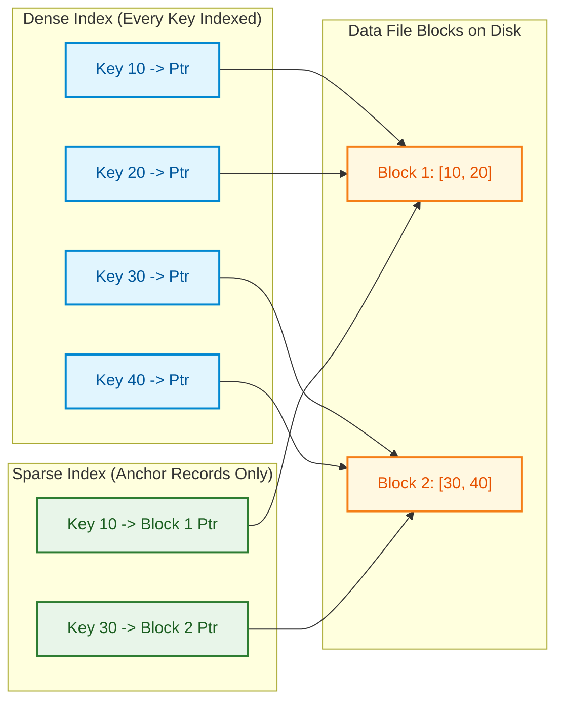

import CoreDoseLessonHeader from '@site/src/components/CoreDose/CoreDoseLessonHeader';
import CoreDoseTOC from '@site/src/components/CoreDose/CoreDoseTOC';
import CoreDoseNav from '@site/src/components/CoreDose/CoreDoseNav';

# Ordered Indices: Dense vs. Sparse Index Structures

<CoreDoseLessonHeader />

## 💡 Core Intuition

### 🍳 The Everyday Analogy: The Dictionary Thumb Tabs vs. The Complete Glossary

Imagine consulting a massive $2,000$-page unabridged Oxford English Dictionary:
1. **The Dense Index (The Back Glossary):** Imagine an index at the back that lists every single word in the dictionary alongside its exact page and paragraph number. If there are $300,000$ words in the English language, this index contains $300,000$ lines. It is exhaustive and precise, but the index itself is so heavy and thick that browsing through the index takes considerable time and shelf space.
2. **The Sparse Index (The Carved Thumb Tabs):** Instead of indexing every word, the publisher carves alphabetical notches along the paper edge—one tab for `A`, one for `B`, one for `C`... In total, there are only $26$ thumb tabs. To find "Elephant", you stick your thumb directly into tab `E`, open the book to page $450$ (the start of `E`), and flip forward a few pages to locate the word. 

The thumb tabs represent a **Sparse Index**: you index only the **first word of each page (anchor record)**. Because the dictionary pages are already physically sorted, a tiny index of 26 tabs guides you to the correct page in a single motion!

### 💻 Bridging to Computer Science

In database physical storage, an index is an auxiliary data structure designed to accelerate data retrieval without altering the physical location of records in the primary table.

```
Index Structure Dimensions:
  ├── Dense Index   ===> Entry for EVERY search key in data file (Can index unordered files)
  └── Sparse Index  ===> Entry for only SOME records / blocks (REQUIRES physically ordered files)
```

Because index files consist strictly of two fields—a search key ($V$) and a physical disk pointer ($P$)—they are orders of magnitude smaller than data records, allowing the database to cache the entire index in high-speed RAM.

---

<CoreDoseTOC toc={toc} />

---

## 📚 Core Deep-Dive & Concepts

### Key Terminology of Relational Indexing

1. **Secondary Access Path:** An index provides an alternative access pathway to locate records based on a specific attribute without modifying the primary physical placement of rows on disk.
2. **Index Entry Anatomy:** An individual record in an index file consists of exactly two fields:
   $$\text{Index Entry } = \langle K_i, \quad P_i \rangle$$
   - $K_i$: The search key attribute value.
   - $P_i$: A physical disk pointer (either a **Block Pointer** to a disk page, or a **Record Pointer** to a specific tuple offset inside a page).
3. **Ordering Invariant:** While the underlying data file may be ordered or unordered, **the index file itself is ALWAYS physically ordered by search key $K_i$**. This guarantees that the query engine can always execute binary search over the index blocks.

---

### Dense Index Architecture

**Definition:** An index is **Dense** if the index file contains an entry for **every single search key value** present in the main data file:
$$\text{Number of Index Entries } \approx \text{Number of Records in Data File } (r)$$
*(Assuming unique search keys).*

```
Index File (Ordered, Dense)                Data File (Unordered or Ordered)
[ Key: 101 | Pointer ] -------------------> [ Rec: 101, Alice, Engineering, $120k ]
[ Key: 102 | Pointer ] -------------------> [ Rec: 102, Bob,   Marketing,   $95k  ]
[ Key: 103 | Pointer ] -------------------> [ Rec: 103, Charlie, Legal,     $110k ]
[ Key: 104 | Pointer ] -------------------> [ Rec: 104, Dave,  Sales,       $85k  ]
```

#### Operational Properties
- **Speed:** Faster lookups. The database engine can verify whether a record exists purely by searching the index, without reading the underlying data block into memory.
- **Storage Overhead:** Substantial storage consumption. The index file contains millions of entries.
- **Applicability:** Dense indices can be built over **both ordered and unordered** data files.

---

### Sparse (Non-Dense) Index Architecture

**Definition:** An index is **Sparse** if the index file contains entries for only **a subset of records** in the main data file—typically exactly **one entry per physical data block**:
$$\text{Number of Index Entries } = \text{Total Number of Data Blocks } (b)$$

The indexed key value is the **Anchor Record** (usually the lowest search key value stored within that physical block).

```
Sparse Index File (One entry per block)      Physically Ordered Data File
                                           +--- Data Block 1 -------------------+
[ Key: 101 | Block 1 Ptr ] --------------->| Rec: 101, Alice, Engineering, $120k|
                                           | Rec: 105, Frank, Support,     $70k |
                                           +------------------------------------+
                                           +--- Data Block 2 -------------------+
[ Key: 110 | Block 2 Ptr ] --------------->| Rec: 110, Grace, Finance,     $130k|
                                           | Rec: 115, Henry, DevOps,      $115k|
                                           +------------------------------------+
```

#### The Strict Prerequisite for Sparse Indexing
> **The Ordering Law of Sparse Indices:** A Sparse Index can **ONLY be constructed if the underlying data file is physically sorted on the search key**. If the data file is unordered (a Heap file), a sparse index cannot be used, because knowing the lowest key in a block provides zero information about where any other key resides!

#### Lookup Algorithm in Sparse Indices
To locate a record with search key $K$:
1. Perform binary search on the sparse index to find the largest index entry $K_i$ such that $K_i \le K$.
2. Follow the associated block pointer $P_i$ to read the physical data block into memory.
3. Perform an in-memory linear scan of that single block to locate the exact record.

---

### Dense vs. Sparse: The Structural Comparison

| Dimension | Dense Index | Sparse Index |
| :--- | :--- | :--- |
| **Number of Entries** | One entry per search key value ($\approx r$) | One entry per data block ($= b$) |
| **Data File Requirement** | Can be **Ordered or Unordered** | **MUST be physically Ordered** |
| **Index File Size** | Large (Takes more disk blocks) | Extremely Small (Fits easily in RAM) |
| **Search Time** | Fast ($\lceil \log_2 b_i \rceil + 1$ data I/O) | Fast ($\lceil \log_2 b_{\text{sparse}} \rceil + 1$ data I/O) |
| **Insertion Overhead** | Must insert an index record for every row | Only updates index when anchor record changes |
| **Key Existence Check** | Can confirm key existence without touching data file | Must always fetch the data block to confirm key existence |

---

### Step-by-Step Solved Problem: Comparing Dense vs. Sparse Footprint

**System Specifications:**
- Total records: $r = 30,000$
- Data record size: $R = 100\text{ Bytes}$
- Disk block size: $B = 1024\text{ Bytes}$
- Search key size: $V = 9\text{ Bytes}$
- Block pointer size: $P = 6\text{ Bytes}$
- Index record size: $R_i = V + P = 9 + 6 = 15\text{ Bytes}$

#### Step 1: Compute Data File Characteristics
$$Bfr = \left\lfloor \frac{B}{R} \right\rfloor = \left\lfloor \frac{1024}{100} \right\rfloor = 10 \text{ records/block}$$
$$b = \left\lceil \frac{r}{Bfr} \right\rceil = \left\lceil \frac{30,000}{10} \right\rceil = 3,000 \text{ data blocks}$$

#### Step 2: Compute Index Blocking Factor
$$Bfr_i = \left\lfloor \frac{B}{R_i} \right\rfloor = \left\lfloor \frac{1024}{15} \right\rfloor = \lfloor 68.26 \rfloor = 68 \text{ index entries per block}$$

#### Step 3: Architecture A: Dense Index Calculations
1. Number of index entries:
   $$r_i = 30,000 \text{ entries}$$
2. Number of index blocks:
   $$b_{\text{dense}} = \left\lceil \frac{30,000}{68} \right\rceil = \lceil 441.17 \rceil = 442 \text{ blocks}$$
3. Total I/O Search Cost:
   $$\text{Search Cost} = \lceil \log_2(442) \rceil + 1 = 9 + 1 = 10 \text{ block transfers}$$

#### Step 4: Architecture B: Sparse Index Calculations
1. Number of index entries (one per data block):
   $$r_{\text{sparse}} = b = 3,000 \text{ entries}$$
2. Number of index blocks:
   $$b_{\text{sparse}} = \left\lceil \frac{3,000}{68} \right\rceil = \lceil 44.11 \rceil = 45 \text{ blocks}$$
3. Total I/O Search Cost:
   $$\text{Search Cost} = \lceil \log_2(45) \rceil + 1 = 6 + 1 = 7 \text{ block transfers}$$

#### Footprint & Latency Takeaway:
- Sparse indexing shrinks the index from **$442$ blocks down to $45$ blocks** (a $90\%$ storage reduction!).
- Search latency drops from $10$ disk reads down to $7$ disk reads.
- Furthermore, because $45\text{ blocks} \times 1\text{ KB} = 45\text{ KB}$, the **entire sparse index easily fits inside CPU L2/L3 cache**, reducing physical disk accesses to just **$1$ single disk transfer**!

---

## 📐 Architecture / Visual Blueprint

The following diagram contrasts how a Dense Index searches an arbitrary table versus how a Sparse Index uses block anchors on an ordered table:



---

## 🏭 In The Real World: Production Case Study

### High-Volume Analytical Databases: ClickHouse Sparse Primary Index

ClickHouse is recognized as one of the fastest analytical columnar databases in the world, routinely executing aggregation queries across trillions of rows in milliseconds.

#### The Problem with Dense Indices at Petabyte Scale
If ClickHouse used a Dense index for a table with $10\text{ billion}$ events:
- Dense index entries: $10\text{ billion}$
- At $32\text{ bytes}$ per index entry: $320\text{ Gigabytes}$ of index data alone!
- Caching this index in RAM on a single node would exceed memory capacity.

#### The ClickHouse Sparse Index Design
ClickHouse structures primary keys as a **Sparse Index**:
1. It partitions incoming rows into sorted granule blocks of $8,192$ rows.
2. The primary index stores only **one index mark per granule** ($8,192$ rows).
3. For $10\text{ billion}$ rows, the number of index marks is:
   $$\frac{10,000,000,000}{8,192} \approx 1.22\text{ million marks}$$
4. Total index size in memory:
   $$1.22\text{M} \times 32\text{ B} \approx 39\text{ Megabytes!}$$

A 39 MB sparse index fits permanently in RAM on any cheap cloud server. ClickHouse scans the sparse index in microseconds, skips billions of unneeded rows via range pruning, and fetches only the exact granule blocks required.

---

## 🎯 Exam & Interview Pitfall Check

:::tip Core Conceptual Questions

**Question 1:** Why can a Sparse Index not be built on a Heap (unordered) data file?

**Answer:**
A sparse index only stores the anchor key value (e.g. the minimum key) of each physical data block. 
If the underlying data file is sorted, the database can safely deduce that if a block's anchor is $50$ and the next block's anchor is $100$, all keys between $50$ and $99$ must physically reside inside that first block.
In an unordered (Heap) file, records are placed randomly. A block with anchor $50$ might contain $50, 1000, 2,$ and $942$. Knowing the anchor key provides zero predictive information regarding what other values reside in that block. Therefore, a sparse index over an unordered file cannot guarantee that a key will be found, rendering it invalid.

---

**Question 2:** If an index entry contains the key and a block pointer, why is the access cost formula $\lceil \log_2(b_i) \rceil + 1$?

**Answer:**
- $\lceil \log_2(b_i) \rceil$: Represents the number of block accesses needed to binary-search the physically sorted index file containing $b_i$ index blocks to locate the appropriate index entry.
- $+ 1$: Represents the **single additional physical disk block transfer** required to follow the retrieved block pointer from memory down to the actual data file to fetch the real tuple containing full column values.

:::

:::warning Common Interview Traps

**Trap 1: Assuming Dense Indices are always slower than Sparse Indices.**
In terms of pure I/O, a dense index can answer index-only queries (`SELECT COUNT(*) WHERE id = 10` or `SELECT id FROM table WHERE id = 10`) with zero accesses to the data file! A sparse index can never confirm non-existence without fetching the data block.

**Trap 2: Forgetting to add the final $+1$ data block fetch.**
When calculating total query I/O cost using an index, candidates frequently calculate $\lceil \log_2 b_i \rceil$ and stop. Binary search on the index only brings the index record into memory; fetching the actual row requires $+1$ additional data block transfer.

:::

---

<CoreDoseNav
  prev={{
    title: "File Organizations: Heap, Sorted & Hashed Files",
    url: "/coredose/dbms/chapter-09/file-organizations-heap-sorted-hash"
  }}
  next={{
    title: "Primary, Clustering & Secondary Indices",
    url: "/coredose/dbms/chapter-09/primary-clustering-and-secondary-index"
  }}
  courseUrl="/coredose/dbms"
/>
