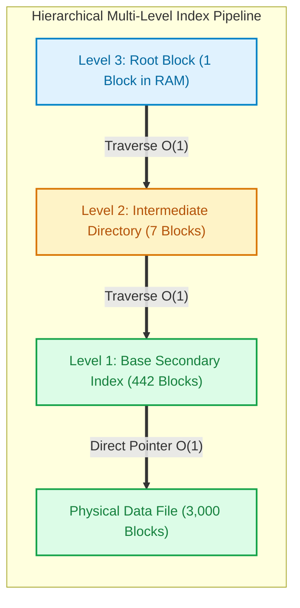

import CoreDoseLessonHeader from '@site/src/components/CoreDose/CoreDoseLessonHeader';
import CoreDoseTOC from '@site/src/components/CoreDose/CoreDoseTOC';
import CoreDoseNav from '@site/src/components/CoreDose/CoreDoseNav';

# Primary, Clustering & Secondary Indices: Multi-Level Indexing

<CoreDoseLessonHeader />

## 💡 Core Intuition

### 🍳 The Everyday Analogy: The University Library System

Imagine managing a university library containing $30,000$ books:
1. **The Primary Index (Call Number Shelving):** The physical books are arranged on shelves in strict numerical order by their unique Book ID. The librarian places a card at the end of each bookcase displaying the lowest Book ID on that shelf (Block Anchor). This index is **sparse**: one entry per bookcase.
2. **The Clustering Index (Department Sections):** Books are grouped by academic department (e.g. Physics, Computer Science, Literature). While books are physically sorted by department, many books share the exact same department tag (a non-key attribute). The index lists each department name once, with a pointer to the first bookcase where that department's books begin.
3. **The Secondary Index (Author / Topic Card Catalog):** Books remain where they are, but students frequently search by Author name. Because the shelves are not sorted alphabetically by author, the library maintains a card catalog drawer where **every single book has a card** with the author's name and its exact shelf coordinate. This index is **dense**: exactly $30,000$ cards for $30,000$ books.
4. **The Multi-Level Index (The Master Directory):** If the author card catalog grows to fill 442 physical drawers, walking past all 442 drawers to find an author becomes tedious. The library adds a master directory board on the wall listing the author range for each drawer cabinet, reducing search steps from hundreds down to three quick lookups.

### 💻 Bridging to Computer Science

Database physical engines categorize single-level ordered indices into three primary classes based on two architectural questions:
1. Is the physical data file sorted on the indexing field?
2. Is the indexing field a candidate key (unique) or a non-key (duplicates allowed)?

```
Physical Indexing Taxonomy:
  ├── Single-Level Indices
  │     ├── Primary Index      ===> Ordered Data File + Primary/Candidate Key (Sparse)
  │     ├── Clustering Index   ===> Ordered Data File + Non-Key Ordering Field (Sparse)
  │     └── Secondary Index    ===> Unordered Data File + Key or Non-Key Field (Dense)
  └── Multi-Level Indices
        ├── Static Multi-Level Hierarchy (ISAM)
        └── Dynamic Self-Balancing Trees (B-Trees & B+ Trees)
```

---

<CoreDoseTOC toc={toc} />

---

## 📚 Core Deep-Dive & Architectural Concepts

### 1. The Core Indexing Taxonomy Matrix

The fundamental relationship between physical file ordering and index types is summarized below:

| Index Type | Physical File Ordered On Field? | Field Has Unique Values (Key)? | Index Density | Number of Index Entries |
| :--- | :--- | :--- | :--- | :--- |
| **Primary Index** | **Yes** (Ordered) | **Yes** (Primary / Candidate Key) | **Sparse** | Equals number of physical data blocks ($b$) |
| **Clustering Index** | **Yes** (Ordered) | **No** (Non-Key with duplicates) | **Sparse** | Equals number of distinct non-key values |
| **Secondary Index (Key)** | **No** (Unordered) | **Yes** (Candidate Key) | **Dense** | Equals number of records in data file ($r$) |
| **Secondary Index (Non-Key)**| **No** (Unordered) | **No** (Non-Key with duplicates) | **Dense** | Equals number of records or unique values + pointer bucket |

---

### 2. Primary Index Architecture

**Definition:** A Primary Index is an ordered index file built on an underlying data file that is **physically sorted on its Primary Key** (or Candidate Key).

**Physical Structure:**
An index entry consists of two fields:
$$\text{Index Entry} = \langle K_i, P_i \rangle$$
Where:
- $K_i$: The search key value (typically the **anchor key** / minimum key of the physical data block).
- $P_i$: A block pointer pointing directly to the disk block address.

Because the underlying file is sorted on $K$, the engine only needs one entry per disk block.

```
Index File (Sorted by ID):           Physical Data File (Sorted by ID):
┌───────────┬──────────────┐         ┌─────────────────────────────────┐
│ ID = 101  │ Block Ptr 1  ├────────►│ [101, Alice]  [104, Bob]        │ (Block 1)
├───────────┼──────────────┤         ├─────────────────────────────────┐
│ ID = 108  │ Block Ptr 2  ├────────►│ [108, Carol]  [112, Dave]       │ (Block 2)
├───────────┼──────────────┤         ├─────────────────────────────────┐
│ ID = 115  │ Block Ptr 3  ├────────►│ [115, Eve]    [120, Frank]      │ (Block 3)
└───────────┴──────────────┘         └─────────────────────────────────┘
```

**Key Architectural Rules:**
- A physical table can have **at most one** primary index, because records can only be stored in one physical sorted order on disk.
- Number of index entries:
  $$r_i = b_{\text{data}}$$
  Where $b_{\text{data}}$ is the total number of physical disk blocks occupied by the data file.

---

### 3. Clustering Index Architecture

**Definition:** A Clustering Index is built on a data file that is **physically sorted on a non-key attribute** (an attribute containing duplicate values, such as `Department_ID`, `City`, or `Branch_Code`).

**Physical Mechanism:**
All records sharing the same attribute value are physically stored consecutively in adjacent blocks on disk. 
The clustering index contains one entry for each distinct value of the clustering attribute, containing:
$$\langle V_i, P_i \rangle$$
Where $P_i$ is a block pointer to the **first physical block** containing records with value $V_i$.

```
Clustering Index:                    Data File (Physically Clustered by Dept):
┌───────────┬──────────────┐         ┌────────────────────────────────────────┐
│ Dept: CS  │ Block Ptr 1  ├────────►│ [CS, Alice]   [CS, Bob]    [CS, Carol] │ (Block 1)
├───────────┼──────────────┤         ├────────────────────────────────────────┤
│ Dept: EE  │ Block Ptr 2  ├────────►│ [CS, Dave]    [EE, Frank]  [EE, Grace] │ (Block 2)
├───────────┼──────────────┤         ├────────────────────────────────────────┤
│ Dept: ME  │ Block Ptr 3  ├────────►│ [ME, Hank]    [ME, Ivy]    [ME, John]  │ (Block 3)
└───────────┴──────────────┘         └────────────────────────────────────────┘
```

**Key Architectural Rules:**
- A table can have **at most one** clustering index, because physical data records can only be ordered on one non-key column on disk.
- A table **cannot have both** a primary index and a clustering index simultaneously, because a file cannot be simultaneously sorted on its primary key and on a different non-key attribute.
- Number of index entries:
  $$r_i = \text{Count of Distinct Values of the Clustering Attribute}$$

---

### 4. Secondary Index Architecture

**Definition:** A Secondary Index is built on an attribute for which the underlying physical data file is **not physically ordered**.

**Why Secondary Indices Are Mandatory:**
In enterprise production databases, queries frequently filter by attributes other than the primary ordering key (e.g. searching by `Email`, `PhoneNumber`, or `Transaction_Date` on a table physically ordered by `User_ID`). 
Without a secondary index, every such query forces a full table scan ($O(b)$ disk block accesses).

#### Case A: Secondary Index on a Candidate Key (Unique Values)
- The search attribute contains distinct values for every record.
- Because the physical data file is not sorted on this attribute, consecutive records in the index point to completely random physical data blocks across disk.
- **Index Density:** **Strictly Dense**. Every single record in the data file must have a corresponding entry in the secondary index. If any record were omitted, the engine could not locate it.
- Number of index entries:
  $$r_i = r_{\text{data}}$$

#### Case B: Secondary Index on a Non-Key Attribute (Duplicate Values)
When the secondary attribute contains duplicates (e.g. `City = 'New York'` shared by thousands of users):
1. **Direct Dense Approach:** Multiple index entries with identical keys point to different records.
2. **Indirection Bucket (Two-Level Pointer List):** The index entry stores $\langle V_i, P_{\text{bucket}} \rangle$, where $P_{\text{bucket}}$ points to a contiguous block of record pointers.

```
Secondary Index (Dense on Email):    Unordered Heap File (Arbitrary Physical Order):
┌────────────────┬─────────────┐     ┌────────────────────────────────────────┐
│ a@work.com     │ Rec Ptr ───┼────►│ [108, Carol, c@work.com]               │ (Block 1)
├────────────────┼─────────────┤ ┌──►│ [101, Alice, a@work.com]               │
│ b@work.com     │ Rec Ptr ───┼─│───┼────────────────────────────────────────┤
│ c@work.com     │ Rec Ptr ───┼─┘  ┌►│ [115, Eve,   e@work.com]               │ (Block 2)
│ e@work.com     │ Rec Ptr ───┼────┘ │ [104, Bob,   b@work.com]               │
└────────────────┴─────────────┘     └────────────────────────────────────────┘
```

**Key Architectural Rules:**
- A single physical table can have **multiple secondary indices** (e.g. one on `Email`, one on `Phone`, one on `Created_At`).
- Secondary index pointers are **record pointers** (specifying physical Block ID + Tuple Slot offset within the block) rather than simple block anchor pointers.

---

### 5. Multi-Level Indexing

**The Problem with Single-Level Indices:**
As datasets grow into millions of records, even a single-level index file becomes massive:
- If a secondary index contains $1,000,000$ entries of $16\text{ bytes}$ each, the index file alone requires $16\text{ MB} = 3,907\text{ disk blocks}$ ($4\text{ KB}$ each).
- Searching this sorted index via binary search requires:
  $$\lceil \log_2(3,907) \rceil = 12\text{ disk I/O accesses}$$
- Each random disk block access costs mechanical seek time or NVMe latency.

**The Solution:**
Treat the single-level index itself as a sorted data file, and build a **sparse primary index** on top of it (Level 2).
Repeat this recursive hierarchical indexing until the top level fits inside **exactly one disk block** (The Root Block).

```
Level 3 (Root):      Fits in 1 Block (Kept permanently in RAM)
   │
   ▼
Level 2 (Directory): 68 Blocks
   │
   ▼
Level 1 (Base Index):442 Blocks
   │
   ▼
Data File:           3,000 Blocks
```

**Multi-Level Access Cost Formula:**
$$\text{Total Block Transfers} = t_{\text{levels}} + 1$$
Where:
- $t_{\text{levels}}$ is the tree depth (number of index levels traversed from Root to Base).
- $+ 1$ is the single final access to fetch the data block/record.

---

### 6. Mathematical Solved Derivation: Single-Level vs Multi-Level

Let us walk through a complete, step-by-step mathematical problem to observe the dramatic performance leap enabled by index structures.

#### Given System Specifications
- Total data records: $r = 30,000$ records.
- Disk block size: $B = 1,024\text{ Bytes}$.
- Unspanned fixed record size: $R = 100\text{ Bytes}$.
- Search key field size: $V = 9\text{ Bytes}$.
- Block pointer size: $P = 6\text{ Bytes}$.

---

#### Step 1: Base Data File Analysis
1. **Blocking Factor of Data File ($Bfr$):**
   $$Bfr = \left\lfloor \frac{B}{R} \right\rfloor = \left\lfloor \frac{1024}{100} \right\rfloor = 10\text{ records / block}$$
2. **Number of Data Blocks Required ($b$):**
   $$b = \left\lceil \frac{r}{Bfr} \right\rceil = \left\lceil \frac{30,000}{10} \right\rceil = 3,000\text{ blocks}$$
3. **Search Cost Without Index (Unordered Heap):**
   - Average Linear Scan: $b / 2 = 1,500\text{ block accesses}$.
   - Worst-case Linear Scan: $b = 3,000\text{ block accesses}$.

---

#### Step 2: Dense Secondary Index Analysis
1. **Index Entry Size ($R_i$):**
   $$R_i = V + P = 9\text{ B} + 6\text{ B} = 15\text{ Bytes}$$
2. **Blocking Factor of Index File ($Bfr_i$):**
   $$Bfr_i = \left\lfloor \frac{B}{R_i} \right\rfloor = \left\lfloor \frac{1024}{15} \right\rfloor = \lfloor 68.26 \rfloor = 68\text{ entries / block}$$
3. **Number of Index Entries ($r_i$):**
   Because the secondary index is dense over a candidate key:
   $$r_i = r = 30,000\text{ entries}$$
4. **Number of Index Blocks Required ($b_i$):**
   $$b_i = \left\lceil \frac{r_i}{Bfr_i} \right\rceil = \left\lceil \frac{30,000}{68} \right\rceil = \lceil 441.17 \rceil = 442\text{ blocks}$$
5. **Single-Level Index Search Cost:**
   - Binary search on sorted index blocks:
     $$\lceil \log_2(b_i) \rceil = \lceil \log_2(442) \rceil = \lceil 8.78 \rceil = 9\text{ block accesses}$$
   - Follow pointer to actual data record: $+ 1\text{ block access}$.
   $$\text{Total Cost} = 9 + 1 = 10\text{ block accesses!}$$

**Performance Result:** Disk I/O dropped from $3,000$ down to $10$—a **$300\times$ speedup**!

---

#### Step 3: Multi-Level Index Extension
Now, construct a multi-level sparse index hierarchy over the $442$ base index blocks:
1. **Level 1 (Base Index):** $b_1 = 442\text{ blocks}$.
2. **Level 2 (Sparse Index over Level 1):**
   - Each entry in Level 2 stores the anchor key ($9\text{ B}$) + pointer ($6\text{ B}$) to a Level 1 block.
   - Number of entries in Level 2 = number of blocks in Level 1 = $442$ entries.
   - Blocks required for Level 2:
     $$b_2 = \left\lceil \frac{442}{Bfr_i} \right\rceil = \left\lceil \frac{442}{68} \right\rceil = \lceil 6.5 \rceil = 7\text{ blocks}$$
3. **Level 3 (Sparse Index over Level 2 - Root):**
   - Number of entries in Level 3 = number of blocks in Level 2 = $7$ entries.
   - Blocks required for Level 3:
     $$b_3 = \left\lceil \frac{7}{Bfr_i} \right\rceil = \left\lceil \frac{7}{68} \right\rceil = 1\text{ block (Root Block!)}$$

**Multi-Level Query Access Cost:**
Traversing Level 3 $\rightarrow$ Level 2 $\rightarrow$ Level 1 $\rightarrow$ Data Block:
$$\text{Total Block Transfers} = 1\text{ (Level 3)} + 1\text{ (Level 2)} + 1\text{ (Level 1)} + 1\text{ (Data Block)} = 4\text{ block accesses!}$$

By introducing multi-level indexing, query cost plunged from $10$ accesses down to **4 accesses**, regardless of whether binary search memory buffers are available!

---

## 📐 Architecture / Visual Blueprint



---

## 🏭 In The Real World: Production Case Study

### PostgreSQL & MySQL InnoDB Index Architectures

In modern relational engines, index classification directly governs memory management and write amplification:

1. **MySQL InnoDB Clustered Index:**
   - In InnoDB, every table **must have exactly one Clustered Index**, which is always the Primary Key.
   - The leaf nodes of the clustered index do not store pointers: **they physically contain the entire table row data**.
   - When you create a `SECONDARY INDEX` (e.g. `CREATE INDEX idx_email ON users(email)`), InnoDB creates a B+ Tree whose leaf nodes store the **Primary Key value** (not a physical byte offset).
   - Performing `SELECT * FROM users WHERE email = 'test@example.com'` requires a **Secondary Index Lookup** to find the `user_id`, followed by a **Clustered Index Lookup** (Bookmark Lookup) to fetch the full row.

2. **PostgreSQL Heap + Non-Clustered Architecture:**
   - PostgreSQL stores all table data in an unclustered **Heap file**.
   - All indices (whether on the Primary Key or secondary columns) are **Secondary Indices** whose leaf entries store physical Tuples IDs (`TID = (block_number, offset)`).
   - This architecture makes inserts faster (no physical re-clustering), but requires frequent `VACUUM` processes to reclaim deleted space.

---

## 🎯 Exam & Interview Pitfall Check

:::tip Core Conceptual Questions

**Question 1:** Can a database table have more than one Primary Index or more than one Clustering Index?

**Answer:**
No. A physical file can be organized in only **one physical sorted sequence** on disk at any given time.
- If the file is sorted on the Primary Key, it has one Primary Index.
- If the file is sorted on a non-key column, it has one Clustering Index.
- Any additional index created on other columns must be a **Secondary Index**, because the physical rows cannot be simultaneously ordered in multiple distinct sequences.

---

**Question 2:** Why is a Secondary Index on a Candidate Key always dense, whereas a Primary Index is sparse?

**Answer:**
In a Primary Index, the data file is already sorted by the search key. The index only needs to store the anchor key of each block, because all values between block $i$ and block $i+1$ are guaranteed to reside in block $i$.
In a Secondary Index, the underlying data file is unordered relative to the secondary search key. Two consecutive values (e.g. `ID = 101` and `ID = 102`) may reside in completely different blocks hundreds of megabytes apart on disk. If an entry is omitted from the secondary index, the engine has zero way of locating that record without performing a full sequential table scan.

:::

:::warning Common Interview Traps

**Trap 1: Confusing "Clustering Index" in academic theory with "Clustered Index" in MySQL InnoDB.**
- In database theory (Elmasri/Navathe), a **Clustering Index** specifically denotes an index on an ordered file sorted on a **non-key** attribute with duplicate values.
- In commercial systems (MySQL InnoDB / Microsoft SQL Server), a **Clustered Index** refers to the primary index where the leaf pages store the actual table data rows, ordered by the primary key.

**Trap 2: Forgetting that a multi-level index stops strictly when the root level occupies 1 block.**
When calculating the number of levels in a multi-level index, you must keep dividing the block count by the blocking factor ($Bfr_i$) and taking the ceiling until $b_k = 1$. The total number of levels is $k$.

:::

---

<CoreDoseNav
  prev={{
    title: "Ordered Indices: Dense vs. Sparse Index Structures",
    url: "/coredose/dbms/chapter-09/ordered-indices-dense-vs-sparse"
  }}
  next={{
    title: "B-Trees: Structure, Node Capacity & Searching",
    url: "/coredose/dbms/chapter-09/b-trees-structure-and-node-capacity"
  }}
  courseUrl="/coredose/dbms"
/>
