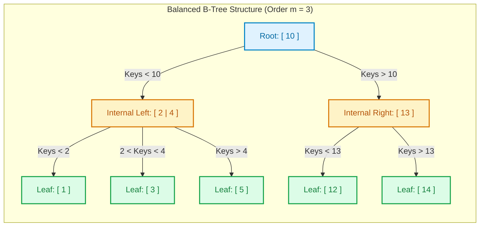

import CoreDoseLessonHeader from '@site/src/components/CoreDose/CoreDoseLessonHeader';
import CoreDoseTOC from '@site/src/components/CoreDose/CoreDoseTOC';
import CoreDoseNav from '@site/src/components/CoreDose/CoreDoseNav';

# B-Trees: Structure, Node Capacity & Searching

<CoreDoseLessonHeader />

## 💡 Core Intuition

### 🍳 The Everyday Analogy: The Multi-Tier Filing Cabinet

Imagine you have a single binary search tree where each decision point only offers two choices: "Go Left" or "Go Right". If you have $1,000,000$ documents, a binary tree requires roughly $\log_2(1,000,000) \approx 20$ sequential decisions. On disk, that means jumping between 20 physically separate magnetic sectors or SSD flash pages—an eternity in I/O time.

Instead, consider a **B-Tree** as an expansive multi-tier filing cabinet:
1. When you open a drawer (a disk block), it does not hold just one piece of paper. It holds **dozens of categorized divider tabs** (keys) and pointers to subsequent drawers.
2. In a single mechanical pull of the drawer (one disk block transfer of $4\text{ KB}$), you read $100$ divider tabs into RAM simultaneously.
3. Your eye scans through all $100$ tabs in nanoseconds in memory, picks the exact sub-cabinet, and jumps directly there.
4. With a branching factor (fanout) of $100$, you reach any document among $1,000,000$ files in just **3 drawer pulls** ($\log_{100}(1,000,000) = 3$).

A B-Tree is a self-balancing, multi-way search tree designed specifically to minimize disk I/O reads by maximizing the number of keys stored in every single disk block.

### 💻 Bridging to Computer Science

Binary search trees (BST, AVL, Red-Black) assume all data resides in main memory, where pointer traversal costs nanoseconds.
In database management systems, data is stored on secondary storage (disk/SSD). Because disk I/O is orders of magnitude slower than CPU memory operations:
$$\text{Disk Seek Time } (5\text{ ms}) \approx 100,000\times \text{ slower than RAM Access } (50\text{ ns})$$
To optimize for disk blocks, an index node must match the physical block size ($B$). A B-Tree of order $m$ packs hundreds of keys and child pointers into each block, dramatically flattening the tree height.

---

<CoreDoseTOC toc={toc} />

---

## 📚 Core Deep-Dive & Architectural Concepts

### 1. Formal Definition & Structural Properties

**Definition:** A B-Tree of **order $m$** is a self-balancing $m$-way search tree that satisfies the following invariants:

1. **Every node** has at most $m$ children.
2. **The Root Node:**
   - Has at least $2$ children (if it is not a leaf node).
   - Can have $0$ children if the entire tree contains only the root.
   - Contains between $1$ and $m - 1$ search keys.
3. **Internal Nodes (all nodes except the root and leaves):**
   - Must have at least $\lceil m / 2 \rceil$ children.
   - Must have at most $m$ children.
   - Must contain between $\lceil m / 2 \rceil - 1$ and $m - 1$ search keys.
4. **Leaf Nodes:**
   - Reside at the **exact same depth** (level), ensuring perfect uniform height balance.
   - Contain between $\lceil m / 2 \rceil - 1$ and $m - 1$ search keys.
5. **Key Ordering:**
   - Within every node, keys are maintained in sorted ascending order:
     $$K_1 < K_2 < \dots < K_{k}$$
   - For any key $K_i$, all keys in the subtree pointed to by child pointer $P_{i}$ are strictly less than $K_i$, and all keys in subtree $P_{i+1}$ are strictly greater than $K_i$.

---

### 2. Node Structural Rule Summary

The exact constraints governing root, internal, and leaf nodes for a B-Tree of order $m$ are summarized below:

| Node Type | Minimum Children | Maximum Children | Minimum Keys | Maximum Keys |
| :--- | :--- | :--- | :--- | :--- |
| **Root Node** | $2$ (or $0$ if leaf) | $m$ | $1$ | $m - 1$ |
| **Internal Nodes** | $\lceil m / 2 \rceil$ | $m$ | $\lceil m / 2 \rceil - 1$ | $m - 1$ |
| **Leaf Nodes** | $0$ | $0$ | $\lceil m / 2 \rceil - 1$ | $m - 1$ |

---

### 3. Physical Node Structure & Capacity Equation

In a standard B-Tree, **both internal nodes and leaf nodes store actual data record pointers** alongside search keys.

```
Physical Block Format of a B-Tree Node:
┌───────┬─────────┬─────────┬───────┬─────────┬─────────┬───────┬─────┬───────┐
│  P_1  │  RecP_1 │   K_1   │  P_2  │  RecP_2 │   K_2   │  P_3  │ ... │  P_m  │
└───────┴─────────┴─────────┴───────┴─────────┴─────────┴───────┴─────┴───────┘
  Tree     Record   Search    Tree     Record   Search    Tree          Tree
 Pointer  Pointer    Key    Pointer  Pointer    Key    Pointer       Pointer
```

**Parameters:**
- $B$: Disk Block Size (e.g. $1,024\text{ Bytes}$ or $4,096\text{ Bytes}$).
- $m$: Order of the B-Tree (maximum child/block pointers per node).
- $P$: Size of a child tree/block pointer (e.g. $6\text{ Bytes}$).
- $V$: Size of the search key value (e.g. $10\text{ Bytes}$).
- $P_r$: Size of a record pointer (e.g. $8\text{ Bytes}$).

**The Node Capacity Inequality:**
To guarantee that a node fits completely inside a single physical disk block:
$$m \cdot P + (m - 1) \cdot (V + P_r) \le B$$

Solving for maximum order $m$:
$$m \cdot P + m \cdot (V + P_r) - (V + P_r) \le B$$
$$m \cdot (P + V + P_r) \le B + V + P_r$$
$$m = \left\lfloor \frac{B + V + P_r}{P + V + P_r} \right\rfloor$$

---

### 4. Step-by-Step B-Tree Insertion Algorithm

**Rule of Thumb:**
- Insertion **always occurs at a leaf node**.
- First let the node fill up to capacity ($m - 1$ keys).
- If a key is inserted into a node that already has $m - 1$ keys (Overflow / Conflict), **split the node** into two halves and **promote the median key** upward into the parent node.
- If the parent node overflows, recursively split and promote upward.
- If the root overflows, split the root and create a **new root** with the promoted median. **This is the only way a B-Tree increases in height** (growing bottom-up).

---

### 5. Detailed Step-by-Step Solved Problem: Insertion

#### Problem Statement
Construct an empty B-Tree of order $m = 3$ by inserting the following sequence of keys:
$$5, 10, 12, 13, 14, 1, 2, 3, 4$$

#### Given Parameters
- Order $m = 3$.
- Maximum child pointers per node: $m = 3$.
- Maximum keys per node: $m - 1 = 3 - 1 = 2$ keys.
- Minimum keys per internal/leaf node: $\lceil 3 / 2 \rceil - 1 = 2 - 1 = 1$ key.

---

#### Stepwise Execution Trace

1. **Insert 5:**
   ```
   [ 5 ]
   ```
2. **Insert 10:**
   ```
   [ 5 | 10 ]  (Node is full: contains 2 keys)
   ```
3. **Insert 12:**
   - Overflows temporarily: `[ 5 | 10 | 12 ]` (3 keys > max 2).
   - Find median: Median of $\{5, 10, 12\}$ is $10$.
   - Push $10$ up as the new root. Left child gets $\{5\}$, right child gets $\{12\}$.
   ```
          [ 10 ]
         /      \
       [ 5 ]   [ 12 ]
   ```
4. **Insert 13:**
   - $13 > 10$, so insert into right leaf `[ 12 ]`:
   ```
          [ 10 ]
         /      \
       [ 5 ]   [ 12 | 13 ]
   ```
5. **Insert 14:**
   - $14 > 10$, insert into right leaf $\rightarrow$ temporary overflow: `[ 12 | 13 | 14 ]`.
   - Median is $13$. Promote $13$ up to parent `[ 10 ]`.
   - Right leaf splits into `[ 12 ]` and `[ 14 ]`.
   ```
          [ 10 | 13 ]
         /     |     \
       [ 5 ] [ 12 ]  [ 14 ]
   ```
6. **Insert 1:**
   - $1 < 10$, insert into left leaf `[ 5 ]`:
   ```
          [ 10 | 13 ]
         /     |     \
     [ 1 | 5 ] [ 12 ] [ 14 ]
   ```
7. **Insert 2:**
   - $2 < 10$, insert into left leaf $\rightarrow$ temporary overflow: `[ 1 | 2 | 5 ]`.
   - Median is $2$. Promote $2$ up to parent.
   - But parent `[ 10 | 13 ]` already has 2 keys!
   - Parent overflows temporarily: `[ 2 | 10 | 13 ]`.
   - Median of parent is $10$. Promote $10$ up to form a **new root**!
   ```
                 [ 10 ]
                /      \
             [ 2 ]     [ 13 ]
            /     \    /     \
          [ 1 ]  [ 5 ] [ 12 ] [ 14 ]
   ```
8. **Insert 3:**
   - $3$ falls between $2$ and $10$, so insert into leaf `[ 5 ]`:
   ```
                 [ 10 ]
                /      \
             [ 2 ]     [ 13 ]
            /     \    /     \
          [ 1 ] [ 3 | 5 ] [ 12 ] [ 14 ]
   ```
9. **Insert 4:**
   - $4$ falls between $2$ and $10$, insert into leaf `[ 3 | 5 ]` $\rightarrow$ temporary overflow: `[ 3 | 4 | 5 ]`.
   - Median is $4$. Promote $4$ to parent `[ 2 ]`.
   - Parent becomes `[ 2 | 4 ]`. Leaf splits into `[ 3 ]` and `[ 5 ]`.
   ```
                 [ 10 ]
                /      \
            [ 2 | 4 ]  [ 13 ]
           /    |    \  /    \
         [ 1 ] [ 3 ] [ 5 ] [ 12 ] [ 14 ]
   ```

**Final Result:** The tree is perfectly balanced, all leaves are at depth 2, and every node satisfies the invariant of having between $1$ and $2$ keys!

---

### 6. B-Tree Deletion Protocol

When deleting a key $K$ from a B-Tree, we must guarantee that no node drops below the minimum key requirement ($\lceil m / 2 \rceil - 1$ keys).

**Case 1: Deletion from a Leaf Node:**
- If the leaf has more than the minimum required keys, simply remove $K$.
- If the leaf drops below minimum keys (Underflow):
  - **Borrow from Sibling (Rotation):** If an adjacent sibling has an extra key, borrow the sibling's key via the parent node.
  - **Merge with Sibling:** If siblings have only minimum keys, merge the node with a sibling and pull down the separating key from the parent.

**Case 2: Deletion from an Internal Node:**
- Replace the deleted key with either its **In-order Predecessor** (largest key in its left subtree) or **In-order Successor** (smallest key in its right subtree).
- Then recursively delete the predecessor/successor from the leaf node using Case 1.

---

### 7. Mathematical Solved Derivation: B-Tree Order & Fanout

#### Problem
Consider a disk with block size $B = 512\text{ Bytes}$. 
Search key size is $V = 8\text{ Bytes}$, block pointer size is $P = 6\text{ Bytes}$, and record pointer size is $P_r = 7\text{ Bytes}$.
Calculate the maximum order $m$ of the B-Tree.

#### Derivation
Apply the physical capacity inequality:
$$m \cdot P + (m - 1) \cdot (V + P_r) \le B$$
Substitute the given values:
$$m \cdot 6 + (m - 1) \cdot (8 + 7) \le 512$$
$$6m + 15(m - 1) \le 512$$
$$6m + 15m - 15 \le 512$$
$$21m \le 527$$
$$m \le \frac{527}{21} \approx 25.095$$

Taking the floor:
$$m = 25$$

**Conclusion:** The maximum order of this B-Tree is $m = 25$. 
Every node can hold at most $25$ child pointers and $24$ search keys.

---

## 📐 Architecture / Visual Blueprint



---

## 🏭 In The Real World: Production Case Study

### SQLite & Embedded Database Storage Engines

While enterprise database engines (like MySQL InnoDB and Postgres) utilize B+ Trees for tabular indices, **SQLite**—the most widely deployed database in the world—uses traditional **B-Trees for table storage**:
1. SQLite's `.sqlite3` file is divided into pages of $4,096\text{ Bytes}$.
2. Table B-Tree pages store the row data (payload) directly inside the interior and leaf pages alongside the integer `ROWID`.
3. For point queries (`SELECT * FROM users WHERE rowid = 42`), if the record is found in an internal node at depth 1, SQLite can terminate search immediately without traversing down to the leaf level!
4. However, this design incurs a severe trade-off for range scans (`SELECT * FROM users WHERE rowid BETWEEN 10 AND 100`), which requires complex in-order tree traversal instead of scanning contiguous leaf blocks.

---

## 🎯 Exam & Interview Pitfall Check

:::tip Core Conceptual Questions

**Question 1:** Why does a B-Tree grow upward from the bottom, unlike standard binary search trees?

**Answer:**
In standard binary search trees, new elements are inserted by attaching new leaf nodes downward below existing leaves, which can cause the tree to become unbalanced or skewed.
In a B-Tree, insertion always occurs into existing leaf nodes. When a leaf exceeds capacity ($m - 1$ keys), it splits into two leaves and promotes its median key upward into its parent. Height increases **only when the root itself overflows** and splits, creating a new root above the previous one. This bottom-up growth guarantees that all leaf nodes remain at the exact same depth.

---

**Question 2:** In a B-Tree of order $m$, what is the worst-case number of nodes created when inserting a single new key?

**Answer:**
If the tree currently has height $h$ (with levels numbered from $1$ to $h$), and every ancestor node along the insertion path is already completely full ($m - 1$ keys), inserting one key triggers cascading splits at every level:
- The leaf node splits (1 new node created).
- All $h - 2$ intermediate internal nodes split ($h - 2$ new nodes created).
- The root splits (1 new node created, plus 1 new root node created).
Total new nodes created in worst case:
$$h + 1\text{ nodes}$$

:::

:::warning Common Interview Traps

**Trap 1: Confusing Order $m$ with Key Capacity.**
The order $m$ represents the **maximum number of child pointers**, not the maximum number of keys. A node of order $m$ contains at most $m - 1$ keys.

**Trap 2: Forgetting Record Pointers in B-Tree Capacity Calculations.**
Unlike B+ Trees, internal nodes in a B-Tree **store record pointers** alongside each key. When calculating node capacity, you must include $(V + P_r)$ for every key slot, which substantially reduces the branching factor.

:::

---

<CoreDoseNav
  prev={{
    title: "Primary, Clustering & Secondary Indices",
    url: "/coredose/dbms/chapter-09/primary-clustering-and-secondary-index"
  }}
  next={{
    title: "B+ Trees: Structure, Leaf Chaining & Node Splits",
    url: "/coredose/dbms/chapter-09/b-plus-trees-structure-and-operations"
  }}
  courseUrl="/coredose/dbms"
/>
