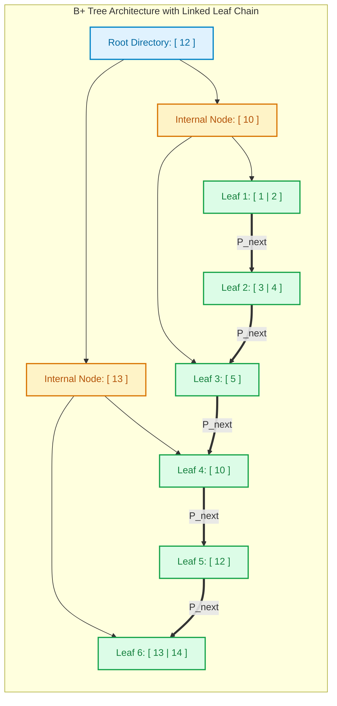

import CoreDoseLessonHeader from '@site/src/components/CoreDose/CoreDoseLessonHeader';
import CoreDoseTOC from '@site/src/components/CoreDose/CoreDoseTOC';
import CoreDoseNav from '@site/src/components/CoreDose/CoreDoseNav';

# B+ Trees: Structure, Leaf Chaining & Node Splits

<CoreDoseLessonHeader />

## 💡 Core Intuition

### 🍳 The Everyday Analogy: The Expressway vs. The Strip Mall

Imagine driving down an interstate highway system:
1. **The B-Tree Flaw (Houses Built on Highway Overpasses):** 
   In a traditional B-Tree, actual houses (data records) are scattered along highway bridges, ramps, and surface streets alike. If you need to deliver mail to houses numbered $10$ through $50$, you must exit the highway, drive up a bridge ramp, inspect house $10$, merge back onto the expressway, climb down an overpass to inspect house $11$, and repeat this roller-coaster path dozens of times (in-order tree traversal).
2. **The B+ Tree Optimization (Clear Highway Signs & A Continuous Ground Boulevard):**
   In a **B+ Tree**, the highway overpasses (internal nodes) contain **only green directional signs** (routing keys)—no houses exist on the highway! 
   All actual houses (data records and record pointers) are placed along a single, smooth, continuous ground-level boulevard (the linked leaf chain).
   To deliver mail for houses $10$ through $50$:
   - You follow the highway signs to find the exit for house $10$ in $3$ quick turns ($O(\log n)$).
   - You drop onto the ground boulevard.
   - You simply cruise straight forward along the street from house $10$ to house $50$ in $O(k)$ time, without ever driving back onto the highway!

### 💻 Bridging to Computer Science

Virtually all modern production database storage engines—including **MySQL InnoDB**, **PostgreSQL**, **Oracle**, and **Microsoft SQL Server**—standardize on the **B+ Tree** as their primary indexing data structure. 

By stripping all record pointers out of internal nodes and linking all leaf nodes in a continuous doubly-linked list, the B+ Tree achieves:
- **Massive Fanout:** Internal nodes hold significantly more keys per disk block, dramatically shrinking the tree height.
- **Blazing Fast Range Scans:** Sequential scans execute via direct pointer chasing along leaf blocks without re-traversing ancestor nodes.

---

<CoreDoseTOC toc={toc} />

---

## 📚 Core Deep-Dive & Architectural Concepts

### 1. B-Tree vs. B+ Tree Architectural Comparison

The engineering distinctions between standard B-Trees and B+ Trees are summarized below:

| Feature / Property | Standard B-Tree | B+ Tree (Industry Standard) |
| :--- | :--- | :--- |
| **Search Key Storage** | Stored in both internal nodes and leaf nodes. | Stored in internal nodes (routing) and leaf nodes (data). |
| **Record Pointer Storage** | Stored in **every node** (internal and leaf). | Stored **strictly in leaf nodes**. |
| **Internal Node Fanout ($m$)** | Lower (limited because record pointers consume space). | **Significantly higher** (only stores keys and child pointers). |
| **Tree Height ($h$)** | Taller for the same number of records. | **Flatter** (typically 3 to 4 levels for billions of records). |
| **Range Queries** | Inefficient ($O(b \log b)$ via in-order traversal). | **Extremely fast** ($O(\log b + k)$ via linked leaf chain). |
| **Leaf Node Chaining** | Leaves are independent (no sibling pointers). | Leaves form a continuous linked list ($P_{\text{next}}$). |
| **Search Predictability** | Variable (terminates early if found in root/internal). | **Completely deterministic** (every search reaches leaf level). |

---

### 2. Physical Node Memory Layouts

#### Internal Node Layout (Routing Directory)
Internal nodes serve exclusively as a routing directory. They store search keys and child tree pointers, with **zero record pointers**:

```
B+ Tree Internal Node (Order m):
┌──────────┬──────────┬──────────┬──────────┬──────────┬─────┬──────────┐
│   P_1    │   K_1    │   P_2    │   K_2    │   P_3    │ ... │   P_m    │
└──────────┴──────────┴──────────┴──────────┴──────────┴─────┴──────────┘
```

**Internal Node Capacity Formula:**
To ensure an internal node fits inside a disk block of size $B$:
$$m \cdot P + (m - 1) \cdot V \le B$$
Where:
- $m$: Order of the internal node (maximum child pointers).
- $P$: Disk block / child tree pointer size (in bytes).
- $V$: Search key size (in bytes).

Solving for maximum order $m$:
$$m = \left\lfloor \frac{B + V}{P + V} \right\rfloor$$

---

#### Leaf Node Layout (Data Records & Sequential Chain)
Leaf nodes store the actual key-pointer pairs, plus a sibling pointer ($P_{\text{next}}$) pointing to the next physical leaf block:

```
B+ Tree Leaf Node:
┌──────────┬──────────┬──────────┬──────────┬─────┬──────────┬──────────┬──────────┐
│   K_1    │  RecP_1  │   K_2    │  RecP_2  │ ... │   K_p    │  RecP_p  │  P_next  │
└──────────┴──────────┴──────────┴──────────┴─────┴──────────┴──────────┴──────────┘
```

**Leaf Node Capacity Formula:**
$$m_{\text{leaf}} \cdot (V + P_r) + P_{\text{next}} \le B$$
Where:
- $m_{\text{leaf}}$: Maximum number of record entries a leaf block can hold.
- $P_r$: Record pointer size (or full row payload size for clustered indices).
- $P_{\text{next}}$: Sibling block pointer size.

Solving for leaf capacity $m_{\text{leaf}}$:
$$m_{\text{leaf}} = \left\lfloor \frac{B - P_{\text{next}}}{V + P_r} \right\rfloor$$

---

### 3. Step-by-Step B+ Tree Insertion Algorithm

**The Fundamental Invariants of B+ Tree Insertion:**
1. Keys are **always inserted into the appropriate leaf node**.
2. **Leaf Node Split (Copy-Up):**
   - When a leaf node exceeds capacity ($> m_{\text{leaf}}$ keys), it splits into two halves:
     - Left leaf retains $\lceil m_{\text{leaf}} / 2 \rceil$ keys.
     - Right leaf retains the remaining keys.
   - The smallest key of the right leaf is **copied upward** into the parent internal node, while **retaining a copy inside the right leaf**.
   - The sibling pointer ($P_{\text{next}}$) is adjusted to connect the left leaf to the right leaf.
3. **Internal Node Split (Push-Up):**
   - When an internal node exceeds capacity ($> m - 1$ keys), it splits into two halves.
   - The median key is **pushed upward** into its parent and **removed from the internal node** (no duplication at the internal level).
4. **Root Split:**
   - If the root node splits, a new root is created with a single key and two children, increasing the tree height by $1$.

---

### 4. Step-by-Step Solved Problem: B+ Tree Insertion

#### Problem Statement
Construct an empty B+ Tree of order $m = 3$ by inserting the following sequence of keys:
$$5, 10, 12, 13, 14, 1, 2, 3, 4$$
*(Assume internal node order $m = 3$ and leaf node maximum capacity = 2 keys).*

---

#### Stepwise Execution Trace

1. **Insert 5 and 10:**
   ```
   [ 5 | 10 ]  (Leaf is full)
   ```
2. **Insert 12:**
   - Leaf overflows: `[ 5 | 10 | 12 ]`.
   - Split leaf into `[ 5 ]` and `[ 10 | 12 ]`.
   - Copy the first key of the right leaf ($10$) upward into a new root.
   - Link leaves together with a sequential pointer ($\rightarrow$):
   ```
             [ 10 ]
            /      \
        [ 5 ] ----► [ 10 | 12 ]
   ```
3. **Insert 13:**
   - $13 \ge 10$, so insert into right leaf.
   - Right leaf becomes `[ 10 | 12 | 13 ]` $\rightarrow$ overflows!
   - Split right leaf into `[ 10 ]` and `[ 12 | 13 ]`.
   - Copy $12$ upward into root `[ 10 ]`.
   ```
             [ 10 | 12 ]
            /     |     \
        [ 5 ] -► [ 10 ] -► [ 12 | 13 ]
   ```
4. **Insert 14:**
   - Insert into rightmost leaf $\rightarrow$ `[ 12 | 13 | 14 ]` overflows.
   - Split leaf into `[ 12 ]` and `[ 13 | 14 ]`.
   - Copy $13$ upward to root $\rightarrow$ Root becomes `[ 10 | 12 | 13 ]` (overflows!).
   - Internal root splits: Median $12$ is **pushed upward** to become the new root.
   ```
                     [ 12 ]
                    /      \
                 [ 10 ]    [ 13 ]
                /     \    /     \
             [ 5 ] -►[10]-►[12]-►[13 | 14]
   ```
5. **Insert 1, 2, 3, 4:**
   - Keys $1, 2, 3, 4$ insert into the left subtrees, triggering leaf splits with copy-up and internal splits with push-up.
   - The leaf chain maintains contiguous sorted pointers:
     $$[1 \mid 2] \longrightarrow [3 \mid 4] \longrightarrow [5] \longrightarrow [10] \longrightarrow [12] \longrightarrow [13 \mid 14]$$

**Result:** Every record is accessible directly at the leaf level, and sequential range queries can scan from $1$ to $14$ without ever visiting the internal root nodes!

---

### 5. Mathematical Solved Derivation: Tree Height & Max Node Accesses

Let us analyze the mathematical progression of B+ Tree levels and compute the maximum I/O accesses required for a large database.

#### Tree Level Capacity Progression
For a B+ Tree of order $m$:

| Level | Number of Nodes | Maximum Keys Stored | Maximum Child Pointers |
| :--- | :--- | :--- | :--- |
| **Level 1 (Root)** | $1$ | $m - 1$ | $m$ |
| **Level 2** | $m$ | $m \cdot (m - 1)$ | $m^2$ |
| **Level 3** | $m^2$ | $m^2 \cdot (m - 1)$ | $m^3$ |
| **Level $n$** | $m^{n-1}$ | $m^{n-1} \cdot (m - 1)$ | $m^n$ |

---

#### Solved Problem: Real-World Database Sizing
**Problem Statement:**
A database table contains $N = 1,000,000$ records indexed by a B+ Tree of order $m = 100$. 
Determine the **maximum number of node accesses (disk block reads)** required to search for any record in the worst case.

#### Stepwise Derivation
1. **Minimum Branching Factor:**
   To find the worst-case (maximum) height, each node must contain the **minimum permissible number of child pointers**.
   $$\text{Min Pointers per Node} = \left\lceil \frac{m}{2} \right\rceil = \left\lceil \frac{100}{2} \right\rceil = 50\text{ pointers}$$
2. **Level-by-Level Node Calculation (Bottom-Up):**
   - **Level 4 (Leaf Level):**
     $$\text{Nodes at Leaf Level} = \left\lceil \frac{1,000,000}{50} \right\rceil = 20,000\text{ nodes}$$
   - **Level 3 (Intermediate):**
     $$\text{Nodes at Level 3} = \left\lceil \frac{20,000}{50} \right\rceil = 400\text{ nodes}$$
   - **Level 2 (Intermediate):**
     $$\text{Nodes at Level 2} = \left\lceil \frac{400}{50} \right\rceil = 8\text{ nodes}$$
   - **Level 1 (Root Node):**
     $$\text{Nodes at Level 1} = \left\lceil \frac{8}{50} \right\rceil = 1\text{ node (Root Block!)}$$

**Conclusion:**
The maximum tree depth is **4 levels**. 
Therefore, even in the worst-case scenario where every single node is only half-full, locating any record among $1,000,000$ entries requires **at most 4 disk block accesses**!

---

## 📐 Architecture / Visual Blueprint



---

## 🏭 In The Real World: Production Case Study

### MySQL InnoDB 3-Level B+ Tree Scaling

In production database administration, architects calculate buffer pool memory sizing based directly on B+ Tree fanout:

1. **InnoDB Page Specifications:**
   - Standard InnoDB page size = $16\text{ KB} = 16,384\text{ Bytes}$.
   - Primary Key (`BIGINT`) = $8\text{ Bytes}$.
   - Child page pointer = $6\text{ Bytes}$.
   - Header overhead $\approx 100\text{ Bytes}$.
2. **Internal Page Fanout:**
   $$m = \frac{16,384 - 100}{8 + 6} \approx 1,163\text{ child pointers per node!}$$
3. **Capacity of a 3-Level Tree:**
   - Level 1 (Root): $1$ page.
   - Level 2: $1,163$ pages.
   - Level 3 (Leaves): $1,163 \times 1,163 \approx 1,352,569$ pages.
   - Assuming each leaf page holds $100$ full table rows:
     $$\text{Total Capacity} = 1,352,569 \times 100 \approx 135,000,000\text{ rows!}$$
4. **RAM Caching & Physical I/O:**
   - Level 1 ($16\text{ KB}$) and Level 2 ($1,163 \times 16\text{ KB} \approx 18.6\text{ MB}$) fit permanently inside the database RAM buffer pool.
   - For a table with **135 million rows**, searching for any single row requires **exactly 1 physical disk read** (to fetch the Level 3 leaf page).

---

## 🎯 Exam & Interview Pitfall Check

:::tip Core Conceptual Questions

**Question 1:** Why is a search key duplicated in both internal nodes and leaf nodes in a B+ Tree, whereas a B-Tree stores each key only once?

**Answer:**
In a B+ Tree, internal nodes act strictly as an index routing directory, while leaf nodes store the actual data records (or record pointers). 
Because the leaf nodes form a complete, continuous sequence of all records, every valid search key must exist in the leaf level. If a key is promoted during an internal split to guide routing in ancestor nodes, a duplicate copy must remain in the leaf node so that range scans and point queries find the actual record payload.

---

**Question 2:** What is the primary difference between node splitting in a leaf node versus an internal node in a B+ Tree?

**Answer:**
- **Leaf Node Split (Copy-Up):** The median key is copied into the parent internal node, but **remains present in the right leaf node** to ensure no data record is lost.
- **Internal Node Split (Push-Up):** The median key is **promoted upward into the parent and removed from the internal node** (it does not exist in either of the two resulting internal child nodes).

:::

:::warning Common Interview Traps

**Trap 1: Confusing internal node order with leaf node order.**
In many database problems, block size $B$ is identical, but the internal node stores $\langle \text{Key, Child Pointer} \rangle$ while the leaf node stores $\langle \text{Key, Record Pointer} \rangle$. If the record pointer (or row data) is larger than the child block pointer, the leaf node capacity $m_{\text{leaf}}$ will be strictly smaller than the internal node order $m$. Always calculate them using their respective equations!

**Trap 2: Forgetting the sibling pointer in leaf block equations.**
When calculating maximum keys per leaf block, candidates frequently forget to subtract the sibling pointer ($P_{\text{next}}$) from the block size before dividing by the key-record size.

:::

---

<CoreDoseNav
  prev={{
    title: "B-Trees: Structure, Node Capacity & Searching",
    url: "/coredose/dbms/chapter-09/b-trees-structure-and-node-capacity"
  }}
  next={{
    title: "Static vs. Dynamic Hashing: Extendible & Linear Hashing",
    url: "/coredose/dbms/chapter-10/static-vs-dynamic-hashing-extendible-and-linear"
  }}
  courseUrl="/coredose/dbms"
/>
