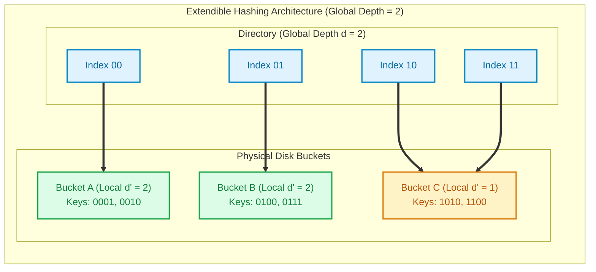

import CoreDoseLessonHeader from '@site/src/components/CoreDose/CoreDoseLessonHeader';
import CoreDoseTOC from '@site/src/components/CoreDose/CoreDoseTOC';
import CoreDoseNav from '@site/src/components/CoreDose/CoreDoseNav';

# Static vs. Dynamic Hashing: Extendible & Linear Hashing

<CoreDoseLessonHeader />

## 💡 Core Intuition

### 🍳 The Everyday Analogy: The Mailroom Wall vs. The Accordion Organizer

Imagine managing incoming physical mail for employees in a growing tech company:
1. **The Static Mailroom (Fixed Cubbies):** 
   You nail a wooden shelf with exactly $10$ cubby holes (buckets) numbered 0 through 9 to the wall. You file mail using the last digit of the employee ID. 
   When the company grows from 50 to 5,000 employees, cubbies overflow. Letters spill onto the floor, so you tape cardboard boxes underneath (overflow chains). Searching for one letter requires sifting through an endless cardboard chain ($O(k)$ time). To fix this, you must tear down the entire wall, buy 100 new cubbies, and manually re-sort every single letter in the building ($O(N)$ full rehash).
2. **The Dynamic Mailroom (Extendible Hashing):**
   Instead of physical wall cubbies, you keep an expandable digital index board (The Directory) and a set of portable storage bins (Buckets). 
   Each bin handles a binary prefix (e.g. `0` and `1`). When bin `0` fills up, you do not touch bin `1`! You simply divide bin `0` into `00` and `01`, leaving the rest of the mailroom completely undisturbed. The directory expands smoothly and incrementally as data grows.

### 💻 Bridging to Computer Science

In database storage, **Hashing** maps search keys directly to disk block addresses using a mathematical hash function $h(K)$, achieving theoretical $O(1)$ point lookups.
However, enterprise database tables are dynamic: rows are constantly inserted and deleted.
- **Static Hashing** uses a fixed number of address buckets. Over time, it suffers from performance degradation (long overflow chains) or massive storage waste.
- **Dynamic Hashing** (Extendible Hashing and Linear Hashing) allows the hash address space to grow and shrink smoothly without requiring a complete database reorganization.

---

<CoreDoseTOC toc={toc} />

---

## 📚 Core Deep-Dive & Architectural Concepts

### 1. Static Hashing Architecture & Inherent Flaws

**Definition:** In Static Hashing, a fixed collection of $M$ physical disk blocks (called **Buckets**) is allocated on disk numbered from $0$ to $M - 1$. 

A deterministic hash function maps any search key $K$ to a bucket address:
$$h(K) \rightarrow \{0, 1, 2, \dots, M - 1\}$$

```
Key K ──► [ Hash Function h(K) ] ──► Bucket Address (0 to M-1) ──► Physical Disk Block
```

#### Collision Resolution in Static Storage
When two distinct keys produce the same bucket address ($h(K_1) = h(K_2)$), a **collision** occurs. 
If the targeted disk block is already full:
1. **Open Addressing (Linear Probing):** The engine searches sequentially for the next available slot in subsequent physical blocks. However, this disrupts locality and severely degrades performance on secondary disk storage.
2. **Overflow Chaining (Closed Addressing):** The full primary bucket allocates an **overflow block** linked via a pointer, forming a linked list of overflow pages.

```
Primary Bucket 2: ┌──────────┬──────────┬─────────┐
                  │ Key: 102 │ Key: 242 │ NextPtr ┼──► Overflow Block: ┌──────────┬──────────┐
                  └──────────┴──────────┴─────────┘                    │ Key: 382 │ NULL     │
                                                                       └──────────┴──────────┘
```

#### The Three Fatal Flaws of Static Hashing
- **Bucket Overflow Chains:** As data accumulates, overflow chains grow long. Searching for an un-indexed key requires traversing multiple chained disk blocks, degrading $O(1)$ access down to $O(k)$ sequential disk I/Os.
- **Catastrophic Reorganization Cost:** If the database expands significantly, the only remediation is to allocate a larger bucket array (e.g. $2M$ buckets) and recompute $h(K)$ for every record in the table—halting production operations for hours.
- **Storage Fragmentation:** If initial allocation is oversized to prevent collisions, empty or underutilized blocks waste large amounts of expensive disk space.

---

### 2. Extendible Hashing Architecture

**Definition:** Extendible Hashing is a dynamic hashing technique that decouples the hashing directory from physical disk buckets, allowing individual buckets to split independently while the directory grows dynamically via doubling.

#### Core Structural Components
1. **The Directory:** 
   - An array of $2^d$ pointers residing in memory.
   - $d$ is the **Global Depth**: it denotes the number of bits of the hash value currently used to index into the directory.
   - The directory contains $2^d$ entries numbered from $0$ to $2^d - 1$ in binary.
2. **The Buckets:** 
   - Physical disk blocks storing data records.
   - Each individual bucket has a **Local Depth** ($d'$).
   - $d'$ denotes the number of hash bits that all keys residing inside that specific bucket have in common.

**The Golden Invariant of Extendible Hashing:**
$$d' \le d \quad \text{for every bucket}$$

The number of distinct directory entries pointing to a bucket with local depth $d'$ is:
$$\text{Directory Pointers to Bucket} = 2^{d - d'}$$

```
Global Depth d = 2
Directory:            Buckets:
┌──────┐
│  00  ├─────────────► Bucket A (Local Depth d' = 2): Keys starting with 00
├──────┤
│  01  ├─────────────► Bucket B (Local Depth d' = 2): Keys starting with 01
├──────┤
│  10  ├───┐
├──────┤   └─────────► Bucket C (Local Depth d' = 1): Keys starting with 1
│  11  ────┘
└──────┘
```
*(Notice that Bucket C has $d' = 1$. Since $d - d' = 2 - 1 = 1$, exactly $2^1 = 2$ directory entries (`10` and `11`) point to Bucket C).*

---

### 3. Step-by-Step Extendible Hashing Insertion Protocol

To insert a record with search key $K$:
1. Calculate the hash value $h(K)$ in binary.
2. Examine the first $d$ bits of $h(K)$ to locate the corresponding directory index.
3. Follow the directory pointer to the physical bucket.
4. **If the bucket has free space:** Insert the record.
5. **If the bucket is full (Overflow):**
   - Check the overflowing bucket's local depth $d'$ against global depth $d$:

#### Case A: If $d' < d$ (Local Depth is Less Than Global Depth)
- **The directory does NOT double!** Directory size remains $2^d$.
- Allocate a new empty bucket on disk.
- Increment the local depth of both the old bucket and the new bucket:
  $$d'_{\text{new}} = d'_{\text{old}} + 1$$
- Redistribute the records of the overflowing bucket between the old bucket and the new bucket based on the $(d')^{\text{th}}$ bit.
- Update directory pointers that previously pointed to the old bucket.

#### Case B: If $d' = d$ (Local Depth Equals Global Depth)
- **Directory Doubling:** The directory must double in size!
- Increment the global depth:
  $$d_{\text{new}} = d + 1$$
- The directory doubles from $2^d$ entries to $2^{d+1}$ entries. Each previous entry $i$ is split into two entries ($2i$ and $2i+1$).
- Allocate a new bucket and increment local depth:
  $$d'_{\text{new}} = d'_{\text{old}} + 1$$
- Rehash and redistribute the records of the overflowing bucket using $(d+1)$ bits.
- Update the directory pointers. All other un-split buckets now have two directory pointers pointing to them.

---

### 4. Step-by-Step Solved Problem: Extendible Hashing Insertion

#### Problem Statement
Assume a bucket capacity of **2 records**. 
Initial global depth $d = 1$ and local depth $d' = 1$. 
Insert records whose 4-bit binary hash values are:
$$K_1 = 0001_2, \quad K_2 = 0100_2, \quad K_3 = 0010_2, \quad K_4 = 1010_2, \quad K_5 = 1100_2, \quad K_6 = 0111_2$$

---

#### Stepwise Execution Trace

1. **Initial State ($d = 1$):**
   - Directory has $2^1 = 2$ entries: `[0]` and `[1]`.
   - Bucket A ($d'=1$): points from `0`.
   - Bucket B ($d'=1$): points from `1`.
2. **Insert $K_1 (0001)$ and $K_2 (0100)$:**
   - First bit of both is `0`. Both insert into Bucket A.
   - Bucket A is now full: `[ 0001, 0100 ]` ($d'=1$).
3. **Insert $K_3 (0010)$:**
   - First bit is `0`. Bucket A is full!
   - Here, local depth $d' = 1$ and global depth $d = 1$ ($d' = d$).
   - **Directory Doubles!** Global depth becomes $d = 2$. Directory entries become `00, 01, 10, 11`.
   - Bucket A splits into Bucket $A_0$ ($d'=2$, keys starting with `00`) and Bucket $A_1$ ($d'=2$, keys starting with `01`).
   - Redistribute keys:
     - $0001 \rightarrow$ starts with `00` $\rightarrow$ Bucket $A_0$.
     - $0010 \rightarrow$ starts with `00` $\rightarrow$ Bucket $A_0$.
     - $0100 \rightarrow$ starts with `01` $\rightarrow$ Bucket $A_1$.
   - Directory pointers:
     - `00` $\rightarrow$ Bucket $A_0$ ($d'=2$)
     - `01` $\rightarrow$ Bucket $A_1$ ($d'=2$)
     - `10` $\rightarrow$ Bucket B ($d'=1$)
     - `11` $\rightarrow$ Bucket B ($d'=1$)
4. **Insert $K_4 (1010)$ and $K_5 (1100)$:**
   - Both start with `1`. Directory entries `10` and `11` point to Bucket B.
   - Both insert into Bucket B. Bucket B is now full: `[ 1010, 1100 ]` ($d'=1$).
5. **Insert $K_6 (0111)$:**
   - First two bits are `01`.
   - Directory `01` points to Bucket $A_1$, which currently has $1$ record (`0100`).
   - Inserts directly into Bucket $A_1$ with **zero splits**! Bucket $A_1$ now holds `[ 0100, 0111 ]`.

**Conclusion:** 
Only the overflowing bucket split. No global table scan or database-wide rehashing was performed!

---

### 5. Linear Hashing Architecture

**Definition:** Linear Hashing is an alternative dynamic hashing algorithm that **completely eliminates the in-memory directory**.

Instead of doubling a directory, Linear Hashing splits buckets sequentially in linear round-robin order ($0, 1, 2, \dots$) using a **split pointer** ($s$) and a family of hash functions:
$$h_i(K) = K \bmod (2^i \cdot N)$$
$$h_{i+1}(K) = K \bmod (2^{i+1} \cdot N)$$
Where $N$ is the initial number of buckets and $i$ is the current round number.

**Key Mechanism:**
- When *any* bucket overflows (creating an overflow block), the bucket pointed to by the split pointer $s$ is split, and $s$ advances:
  $$s = s + 1$$
- When $s$ reaches the end of the bucket range ($2^i \cdot N$), all buckets have doubled. Pointer $s$ resets to $0$, and round number increments $i = i + 1$.
- Advantage: Zero directory memory overhead. Space allocation grows smoothly linearly rather than exponentially.

---

### 6. Architectural Comparison Matrix

| Property | Static Hashing | Extendible Hashing | Linear Hashing | B+ Tree |
| :--- | :--- | :--- | :--- | :--- |
| **Directory Required?** | No | **Yes** (Doubles in RAM) | **No** (Direct computation) | No (Tree structure) |
| **Growth Mode** | Static (Manual rehash) | Dynamic (Doubling) | **Dynamic (Linear)** | Dynamic (Splits) |
| **Point Query Cost** | $O(1)$ (worst $O(k)$) | **Strictly $O(1)$** (2 memory accesses) | **$O(1)$** | $O(\log_m N)$ (3–4 I/Os) |
| **Range Query Support** | **None** | **None** | **None** | **Excellent ($O(k)$ sequential)** |
| **Space Utilization** | Poor (spills/wastes) | Moderate ($\approx 69\%$) | Moderate ($\approx 60\%$) | High ($\approx 70\%$) |

---

## 📐 Architecture / Visual Blueprint



---

## 🏭 In The Real World: Production Case Study

### PostgreSQL Hash Indexes & In-Memory Redis Dictionaries

1. **PostgreSQL Hash Indexes (`USING HASH`):**
   - Historically, PostgreSQL hash indices were not recommended because they were not Write-Ahead Logged (crash-unsafe).
   - In PostgreSQL 10+, hash indexes were completely re-architected with full WAL logging and concurrency control based on a variant of **Linear Hashing**.
   - For pure equality queries on large string keys (e.g. searching 64-character SHA-256 tokens: `WHERE token = 'a8f4c...'`), PostgreSQL hash indexes occupy significantly less disk space than B+ Trees while offering consistent single-hop lookups.

2. **Redis In-Memory Progressive Rehashing:**
   - The open-source in-memory store **Redis** maintains two hash tables (`ht[0]` and `ht[1]`).
   - When the load factor exceeds capacity, Redis triggers **Progressive Rehashing**: instead of rehashing millions of keys in one blocking pause, Redis rehashes a small batch of keys during every client command, seamlessly migrating buckets in background time slices without latency spikes.

---

## 🎯 Exam & Interview Pitfall Check

:::tip Core Conceptual Questions

**Question 1:** Under what exact condition does the directory double in Extendible Hashing?

**Answer:**
The directory doubles **if and only if** an overflow occurs in a bucket whose **Local Depth equals the Global Depth** ($d' = d$). 
If a bucket overflows when its local depth is strictly less than the global depth ($d' < d$), the bucket splits into two new buckets, its local depth increments by $1$, and existing directory pointers are redirected—**without doubling the directory**.

---

**Question 2:** Why are Hashing techniques virtually never used as primary clustered indices in relational databases?

**Answer:**
Relational queries heavily rely on range scans, sorting, and inequalities (`WHERE age BETWEEN 25 AND 35`, `ORDER BY timestamp DESC`, `LIMIT 10`). 
Hash functions uniformly randomize key distributions across buckets to eliminate collisions, completely destroying lexicographical and numerical ordering. As a result, range queries on a hash index degenerate into a full scan of all buckets, making B+ Trees the universal default for relational storage engines.

:::

:::warning Common Interview Traps

**Trap 1: Assuming that a directory doubling splits all buckets in the database.**
When the directory doubles from $2^d$ to $2^{d+1}$, **only the single overflowing bucket is split**! All other buckets remain untouched on disk; the new directory simply creates two duplicate pointer entries for each of the un-split buckets.

**Trap 2: Confusing the number of directory pointers to a bucket.**
A bucket with local depth $d'$ in an Extendible Hashing scheme with global depth $d$ is pointed to by exactly $2^{d - d'}$ directory entries. If $d = 4$ and $d' = 2$, exactly $2^{4 - 2} = 4$ directory entries point to that single physical bucket.

:::

---

<CoreDoseNav
  prev={{
    title: "B+ Trees: Structure, Leaf Chaining & Node Splits",
    url: "/coredose/dbms/chapter-09/b-plus-trees-structure-and-operations"
  }}
  next={{
    title: "Relational Calculus: Tuple Relational Calculus (TRC) & Domain Relational Calculus (DRC)",
    url: "/coredose/dbms/chapter-10/relational-calculus-trc-and-drc"
  }}
  courseUrl="/coredose/dbms"
/>
