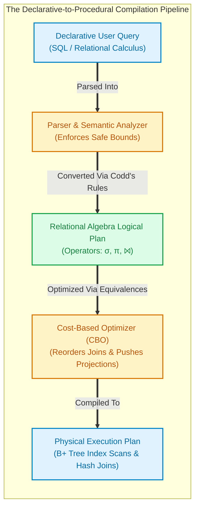

import CoreDoseLessonHeader from '@site/src/components/CoreDose/CoreDoseLessonHeader';
import CoreDoseTOC from '@site/src/components/CoreDose/CoreDoseTOC';
import CoreDoseNav from '@site/src/components/CoreDose/CoreDoseNav';

# Relational Calculus: Tuple Relational Calculus (TRC) & Domain Relational Calculus (DRC)

<CoreDoseLessonHeader />

## 💡 Core Intuition

### 🍳 The Everyday Analogy: The Kitchen Recipe vs. The Dining Order

Imagine ordering a meal at a fine dining restaurant:
1. **The Procedural Approach (Relational Algebra):** 
   You walk into the kitchen, grab the chef, and hand them a detailed, step-by-step checklist: 
   *"First, open refrigerator compartment B. Filter out all eggs with cracks. Boil 500ml of water to 100°C. Drop eggs in for exactly 6 minutes. Peel shells and slice across the vertical axis."* 
   You must explicitly state **HOW** the data is retrieved, filtered, transformed, and joined.
2. **The Declarative Approach (Relational Calculus):** 
   You sit comfortably at your dining table and tell the waiter: 
   *"Bring me two hard-boiled eggs sliced in half."* 
   You specify only **WHAT** output you require, describing the logical conditions that the result must satisfy. You provide zero instructions on what pots to use, which shelf to open, or how the kitchen executes the meal.

### 💻 Bridging to Computer Science

In database theory, query languages are fundamentally divided into two mathematical paradigms:
- **Procedural (Relational Algebra):** An operational language where queries are expressed as a sequence of mathematical operators ($\sigma, \pi, \bowtie$).
- **Non-Procedural / Declarative (Relational Calculus):** A mathematical logic language based on First-Order Predicate Calculus where queries describe the predicate conditions that result tuples must satisfy.

**SQL is directly modeled on Relational Calculus.** When a developer writes a declarative SQL query (`SELECT ... FROM ... WHERE ...`), the database engine's query parser translates that declarative calculus into an equivalent **Relational Algebra Execution Tree** before running it against physical storage.

```
Query Language Spectrum:
  ├── Procedural Query Language      ===> Relational Algebra (Defines WHAT and HOW)
  └── Non-Procedural (Declarative)   ===> Relational Calculus (Defines WHAT, not HOW)
        ├── Tuple Relational Calculus (TRC)   ===> Logic over Tuples (Row-Wise)
        └── Domain Relational Calculus (DRC)  ===> Logic over Attributes (Column-Wise)
```

---

<CoreDoseTOC toc={toc} />

---

## 📚 Core Deep-Dive & Architectural Concepts

### 1. The Multi-Language Comparative Rosetta Stone

To understand how Relational Calculus operates, observe how the exact same query is expressed across SQL, Relational Algebra, TRC, and DRC.

#### Schema Definition
Assume the table:
$$\text{Student}(\underline{\text{Roll\_No}}, \text{Name}, \text{Branch})$$

#### Query: "Find details of all Computer Science students"
- **SQL:**
  ```sql
  SELECT * FROM Student WHERE Branch = 'CSE';
  ```
- **Relational Algebra (Procedural):**
  $$\sigma_{\text{Branch} = \text{'CSE'}}(\text{Student})$$
- **Tuple Relational Calculus (TRC - Row-Wise):**
  $$\{ t \mid \text{Student}(t) \wedge t.\text{Branch} = \text{'CSE'} \}$$
- **Domain Relational Calculus (DRC - Column-Wise):**
  $$\{ \langle r, n, b \rangle \mid \text{Student}(r, n, b) \wedge b = \text{'CSE'} \}$$

---

### 2. Tuple Relational Calculus (TRC)

**Definition:** In Tuple Relational Calculus (TRC), a query is formulated using **tuple variables** that range over entire rows (tuples) of a specified relation.

#### Formal Syntax
$$\{ t \mid P(t) \}$$
Where:
- $t$: A tuple variable representing an output record.
- $P(t)$: A first-order logic predicate formula evaluated on $t$. The result of the query is the set of all tuples $t$ for which $P(t)$ evaluates to **True**.

#### Notation & Conventions
- $t \in r$ or $r(t)$: Denotes that tuple variable $t$ is bound to relation $r$.
- $t[A]$ or $t.A$: Denotes the value of tuple $t$ on attribute $A$.
- $\{ t.A, t.B \mid P(t) \}$: Denotes a projection returning only attributes $A$ and $B$.

#### Mathematical Building Blocks of Formulas ($P$)
A formula in TRC is built recursively using:
1. **Set Membership:** $t \in r$
2. **Attribute Comparisons:** $t.A \text{ op } u.B$ or $t.A \text{ op } c$ (where $\text{op} \in \{=, \ne, <, \le, >, \ge\}$ and $c$ is a constant).
3. **Logical Connectives:**
   - Conjunction (AND): $\wedge$
   - Disjunction (OR): $\vee$
   - Negation (NOT): $\neg$
4. **Quantifiers:**
   - **Existential Quantifier ($\exists$):** "There exists at least one tuple..."
     $$\exists s \in r \, (P(s))$$
   - **Universal Quantifier ($\forall$):** "For all tuples..."
     $$\forall s \in r \, (P(s))$$

---

### 3. Free vs. Bound Variables in Calculus

Understanding variable binding is essential for constructing syntactically valid relational calculus formulas:

- **Bound Variable:** A variable that is quantified by either an existential ($\exists$) or universal ($\forall$) quantifier within the formula.
- **Free Variable:** A variable that is **not** quantified by $\exists$ or $\forall$. 

**The Cardinal Rule of TRC:**
In any query $\{ t \mid P(t) \}$, the result tuple variable $t$ **must be a Free Variable**. 
Any intermediate helper variables introduced inside $P(t)$ to test conditions across other tables must be **Bound Variables** using $\exists$ or $\forall$.

#### Example: Relational Join in TRC
Find the names of all students enrolled in the Course `'CS101'`:
$$\text{Student}(\underline{\text{Roll\_No}}, \text{Name}, \text{Branch}), \quad \text{Enrollment}(\underline{\text{Roll\_No}, \text{Course\_ID}})$$

$$\{ t.\text{Name} \mid \text{Student}(t) \wedge \exists e \in \text{Enrollment} \, (e.\text{Roll\_No} = t.\text{Roll\_No} \wedge e.\text{Course\_ID} = \text{'CS101'}) \}$$
*(Here, $t$ is the free variable defining the output, while $e$ is a bound variable quantified by $\exists$).*

---

### 4. Domain Relational Calculus (DRC)

**Definition:** Domain Relational Calculus (DRC) formulates queries using **domain variables** that range over individual column attribute domains, rather than entire relation tuples.

#### Formal Syntax
$$\{ \langle x_1, x_2, \dots, x_n \rangle \mid \text{COND}(x_1, x_2, \dots, x_n, x_{n+1}, \dots, x_{n+m}) \}$$
Where:
- $\langle x_1, x_2, \dots, x_n \rangle$: The list of domain variables forming the output tuple.
- $\text{COND}$: A logical condition involving both the output variables and any intermediate bound domain variables ($x_{n+1}, \dots$).

#### Example: Projecting Specific Columns in DRC
Using the relation $\text{Instructor}(\underline{\text{ID}}, \text{Name}, \text{Dept}, \text{Salary})$, find the IDs and Names of all instructors in the `'Physics'` department earning more than $75,000$:

$$\{ \langle i, n \rangle \mid \exists d, s \, (\text{Instructor}(i, n, d, s) \wedge d = \text{'Physics'} \wedge s > 75000) \}$$
*(Notice that instead of writing $t.\text{Dept}$, DRC assigns distinct placeholder variables $\langle i, n, d, s \rangle$ to each attribute of the relation).*

---

### 5. Safe Expressions & The Infinite Relation Hazard

A critical theoretical trap in declarative calculus is the generation of **Infinite Relations**.

#### The Hazard: Unsafe Queries
Consider the innocent-looking TRC expression:
$$\{ t \mid \neg(t \in \text{Instructor}) \}$$

**The Problem:**
This formula asks for "every tuple $t$ that is NOT in the Instructor table." 
What does $t$ evaluate to? 
- $t$ could be an integer $42$, the string `'Alice'`, a tuple $\langle 1, \text{'Bob'}, 3.14 \rangle$, a photograph, or an arbitrary sequence of bytes!
- Because the universe of possible tuples is mathematically infinite, this query generates an **infinite relation** that can never be materialized or executed on physical hardware.

#### The Remedy: The Active Domain ($\text{dom}(\psi)$)
To prevent infinite relations, database theory restricts queries to **Safe Expressions**.

**Definition of Active Domain:**
The **Active Domain** of a formula $\psi$, denoted $\text{dom}(\psi)$, is the set of all atomic constant values that explicitly appear in the database instance plus any constants explicitly written inside the query formula itself.

**Formal Safety Criteria for TRC:**
An expression $\{ t \mid P(t) \}$ is **guaranteed to be Safe** if:
1. Every component value of any result tuple $t$ is strictly a member of the active domain $\text{dom}(P)$.
2. For every subformula of the form $\exists u \, (Q(u))$, the subformula evaluates to true only if $u$ takes values from $\text{dom}(Q)$.
3. For every subformula of the form $\forall u \, (Q(u))$, if $u$ contains values outside $\text{dom}(Q)$, $Q(u)$ must evaluate to true.

```
Safe Query:   { t | Student(t) ∧ ¬(t.Branch = 'CSE') }  ===> Finite! Bound to Student relation
Unsafe Query: { t | ¬(Student(t)) }                     ===> Infinite! Matches entire universe
```

---

### 6. Codd's Theorem & Relational Completeness

One of the crowning intellectual milestones of computer science was established by Edgar F. Codd in 1972:

**Codd's Equivalence Theorem:**
The following three formalisms possess **identical expressive computational power**:
1. **Basic Relational Algebra** (Selection, Projection, Cartesian Product, Union, Set Difference, Rename).
2. **Safe Tuple Relational Calculus (TRC)**.
3. **Safe Domain Relational Calculus (DRC)**.

$$\text{Relational Algebra} \equiv \text{Safe TRC} \equiv \text{Safe DRC}$$

**Relational Completeness:**
A database query language is formally defined as **Relationally Complete** if it can express any query that can be formulated in basic Relational Algebra (or equivalently, Safe Relational Calculus).
Both SQL and modern ORMs are relationally complete.

---

## 📐 Architecture / Visual Blueprint



---

## 🏭 In The Real World: Production Case Study

### How PostgreSQL Compiles Declarative SQL to Relational Algebra

When a software engineer executes a query on a production PostgreSQL database:
```sql
SELECT s.Name, e.Course_ID 
FROM Student s 
JOIN Enrollment e ON s.Roll_No = e.Roll_No 
WHERE s.Branch = 'CSE';
```

1. **Parser (Declarative Representation):**
   PostgreSQL parses the SQL string into an internal AST directly representing the Safe Tuple Relational Calculus expression.
2. **Planner / Query Optimizer (Relational Algebra Equivalent):**
   The database planner translates the calculus AST into an initial canonical Relational Algebra plan:
   $$\pi_{\text{Name}, \text{Course\_ID}} \Big( \sigma_{\text{Branch} = \text{'CSE'} \wedge \text{s.Roll\_No} = \text{e.Roll\_No}} (\text{Student} \times \text{Enrollment}) \Big)$$
3. **Algebraic Rewriting (Optimization):**
   The optimizer uses relational algebra equivalence rules:
   - Pushes selection $\sigma_{\text{Branch} = \text{'CSE'}}$ down to `Student` *before* joining.
   - Replaces Cartesian Product $\times$ with an indexed **Hash Join** ($\bowtie$).
4. **Execution Engine:**
   The database executes physical C functions matching the optimized Relational Algebra tree, reading pages from disk via B+ Tree index scans.

---

## 🎯 Exam & Interview Pitfall Check

:::tip Core Conceptual Questions

**Question 1:** What is the technical distinction between a Free Variable and a Bound Variable in Tuple Relational Calculus?

**Answer:**
A tuple variable is **Free** if it is not quantified by an existential ($\exists$) or universal ($\forall$) quantifier within the formula. 
A tuple variable is **Bound** if it is governed by $\exists$ or $\forall$. 
In any valid TRC query $\{ t \mid P(t) \}$, the result tuple variable $t$ must be a free variable, because its unconstrained evaluation yields the output rows returned to the user. All temporary variables used inside $P(t)$ to traverse other tables must be bound.

---

**Question 2:** Why is $\{ t \mid \neg(t \in \text{Student}) \}$ unsafe, and what mathematical concept guarantees query safety?

**Answer:**
The query is unsafe because the condition $\neg(t \in \text{Student})$ is satisfied by any tuple in the universe that is not in the `Student` relation, producing an infinite number of tuples that do not correspond to any valid domain. 
Query safety is guaranteed by the concept of the **Active Domain** ($\text{dom}(\psi)$). A query is safe if all attribute values in any result tuple are guaranteed to be drawn strictly from the set of constants explicitly present in the database relations or in the query formula itself.

:::

:::warning Common Interview Traps

**Trap 1: Believing Relational Completeness implies Turing Completeness.**
Basic Relational Algebra and Relational Calculus are **not Turing complete**. They cannot compute recursive queries (e.g. finding the transitive closure of an organizational hierarchy: "Find all indirect managers of employee X") or execute arbitrary loops without procedural extensions (like SQL recursive CTEs `WITH RECURSIVE`).

**Trap 2: Forgetting to bind helper variables with $\exists$ in multi-table queries.**
When writing TRC queries involving joins, students frequently write $\{ t.\text{Name} \mid \text{Student}(t) \wedge \text{Enrollment}(e) \wedge \dots \}$ without prefixing $\exists e \in \text{Enrollment}$. Leaving $e$ as a free variable causes a syntax error because the query engine cannot determine the cardinality of the Cartesian cross-product.

:::

---

<CoreDoseNav
  prev={{
    title: "Static vs. Dynamic Hashing: Extendible & Linear Hashing",
    url: "/coredose/dbms/chapter-10/static-vs-dynamic-hashing-extendible-and-linear"
  }}
  next={{
    title: "Query Optimization & Query Execution Plans",
    url: "/coredose/dbms/chapter-10/query-optimization-and-cost-execution-plans"
  }}
  courseUrl="/coredose/dbms"
/>
