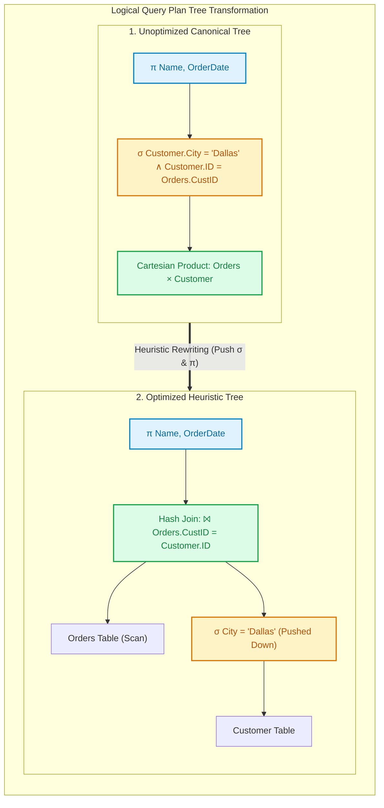

import CoreDoseLessonHeader from '@site/src/components/CoreDose/CoreDoseLessonHeader';
import CoreDoseTOC from '@site/src/components/CoreDose/CoreDoseTOC';
import CoreDoseNav from '@site/src/components/CoreDose/CoreDoseNav';

# Query Optimization & Query Execution Plans

<CoreDoseLessonHeader />

## 💡 Core Intuition

### 🍳 The Everyday Analogy: The GPS Navigation Engine

Imagine you want to drive from New York to Los Angeles during holiday rush hour:
1. **The Naive Path:** You could physically test every conceivable road, country lane, and mountain path in North America. You would eventually reach Los Angeles, but you would burn thousands of gallons of fuel and take years to arrive.
2. **The Smart Navigation Engine (The Query Optimizer):**
   Before your car turns a single wheel, your GPS runs an algorithmic calculation across billions of route permutations in $200\text{ milliseconds}$:
   - It prunes away gravel roads (heuristic rules).
   - It checks real-time traffic statistics and toll costs (Cost-Based Catalog Statistics).
   - It picks the mathematically optimal highway corridor.

In a database management system, a single declarative SQL query can be executed in millions of physically distinct ways. 
The **Query Optimizer** is the intellectual brain of the RDBMS: it transforms declarative SQL into a graph of relational algebra operators, rewrites the graph using algebraic equivalences, estimates physical disk I/O costs using database statistics, and generates the cheapest **Physical Execution Plan** in milliseconds.

### 💻 Bridging to Computer Science

Because SQL is declarative, the user specifies *what* data to retrieve, not *how* to access disk blocks.
A naive execution of a 3-table join might generate a Cartesian product of $10^{15}$ intermediate tuples, crashing the server.
The database query processing pipeline executes in four disciplined phases:

```
Query Processing Architecture:
  1. Parsing & Translation  ===> Checks syntax, produces initial canonical Relational Algebra tree.
  2. Query Optimization     ===> Rewrites tree (Heuristics) + Estimates costs (Cost-Based Optimizer).
  3. Code Generation        ===> Compiles logical operators into executable physical operators.
  4. Execution Engine       ===> Evaluates operators, streams tuples from buffer pool / disk.
```

---

<CoreDoseTOC toc={toc} />

---

## 📚 Core Deep-Dive & Architectural Concepts

### 1. Relational Algebra Equivalence Rules

The optimizer transforms query trees by applying proven mathematical equivalences that guarantee the output set remains identical while intermediate cardinalities shrink drastically.

#### 1. Commutativity of Joins & Cross Products
The order of operands in a join or Cartesian product does not affect the logical result:
$$R \bowtie S \equiv S \bowtie R$$
$$R \times S \equiv S \times R$$

#### 2. Associativity of Joins & Cross Products
Multiple joins can be reordered in any grouping:
$$(R \bowtie S) \bowtie T \equiv R \bowtie (S \bowtie T)$$

#### 3. Cascade of Selections
A complex conjunction of selection predicates can be decomposed into a sequence of individual selections, which commute freely:
$$\sigma_{\theta_1 \wedge \theta_2}(R) \equiv \sigma_{\theta_1}(\sigma_{\theta_2}(R)) \equiv \sigma_{\theta_2}(\sigma_{\theta_1}(R))$$

#### 4. Pushing Selections Down (The Most Powerful Rule)
If predicate $\theta$ involves only attributes belonging to relation $R$, the selection can be pushed **beneath the join** directly onto relation $R$:
$$\sigma_{\theta}(R \bowtie S) \equiv (\sigma_{\theta}(R)) \bowtie S$$

**Why this matters:** If table $R$ has $1,000,000$ rows but only $10$ rows satisfy $\theta$, pushing selection down means joining $10$ rows with $S$ instead of joining $1,000,000$ rows with $S$!

#### 5. Pushing Projections Down
Projections eliminate unneeded columns early, shrinking the physical byte width of intermediate tuples:
$$\pi_{L}(R \bowtie S) \equiv \pi_{L}(\pi_{L_1}(R) \bowtie \pi_{L_2}(S))$$
Where $L_1$ and $L_2$ contain only the required output columns plus the join attributes.

---

### 2. Heuristic Query Optimization Algorithm

Before evaluating numerical disk costs, every commercial engine applies a deterministic set of **Heuristic Rewriting Rules** to the parse tree:

1. **Rule 1: Push Selections ($\sigma$) Down to the Leaves:** Apply selections as early as possible in the tree to minimize relation cardinality before any join or Cartesian product is executed.
2. **Rule 2: Push Projections ($\pi$) Down to the Leaves:** Discard unneeded columns as early as possible to minimize memory footprint per row.
3. **Rule 3: Replace Cartesian Products ($\times$) with Joins ($\bowtie$):** Whenever a Cartesian product is immediately followed by a selection comparing join keys, combine them into an inner join ($\sigma_{R.A = S.A}(R \times S) \rightarrow R \bowtie_{R.A = S.A} S$).
4. **Rule 4: Execute Most Restrictive Joins First:** When joining three or more relations, join the tables that produce the smallest intermediate result first.

---

### 3. Physical Join Algorithms & Cost Formulas

When the logical tree specifies a join ($R \bowtie S$), the optimizer must select a physical C++ algorithm to execute it. 
Assume:
- $R$: Outer relation with $b_r$ blocks and $n_r$ tuples.
- $S$: Inner relation with $b_s$ blocks and $n_s$ tuples.
- $M$: Number of buffer pool frames (memory blocks) available.

---

#### Algorithm 1: Simple (Tuple) Nested Loop Join
For every tuple in $R$, scan through every tuple in $S$:
$$\text{Cost} = b_r + n_r \cdot b_s\text{ disk block transfers}$$
- **Drawback:** Extremely slow. If $R$ has $100,000$ rows and $S$ occupies $1,000$ blocks, this requires $100,000,000$ block I/Os!

---

#### Algorithm 2: Block Nested Loop Join (BNLJ)
Instead of streaming row-by-row, load $M - 2$ blocks of the outer relation $R$ into memory at once, read $1$ block of $S$, compare all pairs in memory, and use $1$ block for output:
$$\text{Cost} = b_r + \left\lceil \frac{b_r}{M - 2} \right\rceil \cdot b_s\text{ block transfers}$$

**Golden Rule:** Always choose the **smaller relation** (fewer blocks $b$) as the **outer relation** to minimize $\lceil b / (M - 2) \rceil$.

---

#### Algorithm 3: Indexed Nested Loop Join
If an index (B+ Tree) exists on the join attribute of inner relation $S$:
$$\text{Cost} = b_r + n_r \cdot c$$
Where $c$ is the cost of traversing the index to find matching tuples in $S$ (typically $2$ to $4$ block I/Os).

---

#### Algorithm 4: Sort-Merge Join
Both relations are sorted on the join key, and a linear merge scan finds matches:
$$\text{Cost} = \text{Cost of Sorting } R + \text{Cost of Sorting } S + (b_r + b_s)$$
If both relations are already sorted (e.g. from a clustered index), cost is strictly:
$$\text{Cost} = b_r + b_s$$

---

#### Algorithm 5: Grace Hash Join
Partitions both $R$ and $S$ into $M - 1$ bucket files on disk using hash function $h_1$, then joins corresponding bucket pairs in memory using hash function $h_2$:
$$\text{Cost} = 3 \cdot (b_r + b_s)\text{ block transfers}$$
*(Phase 1 reads and writes both tables to create partitions: $2(b_r + b_s)$; Phase 2 reads each partition pair once to join: $b_r + b_s$).*

---

### 4. Mathematical Solved Derivation: Join Cost Comparison

#### Problem Statement
Two relations are to be joined:
- Relation $R$ (Orders): $n_r = 10,000$ tuples, $b_r = 1,000$ disk blocks.
- Relation $S$ (Customers): $n_s = 2,000$ tuples, $b_s = 100$ disk blocks.
- Available buffer pool memory frames: $M = 52$ blocks ($M - 2 = 50$).

Calculate and compare the total disk block access cost for:
1. Block Nested Loop Join with $R$ as outer relation.
2. Block Nested Loop Join with $S$ as outer relation.
3. Grace Hash Join.

---

#### Stepwise Mathematical Derivation

#### 1. Block Nested Loop Join ($R$ as Outer Relation):
$$b_r = 1,000, \quad b_s = 100, \quad M - 2 = 50$$
$$\text{Cost} = b_r + \left\lceil \frac{b_r}{M - 2} \right\rceil \cdot b_s$$
$$\text{Cost} = 1,000 + \left\lceil \frac{1,000}{50} \right\rceil \cdot 100 = 1,000 + (20 \cdot 100) = 1,000 + 2,000 = 3,000\text{ block I/Os}$$

---

#### 2. Block Nested Loop Join ($S$ as Outer Relation):
$$b_s = 100, \quad b_r = 1,000, \quad M - 2 = 50$$
$$\text{Cost} = b_s + \left\lceil \frac{b_s}{M - 2} \right\rceil \cdot b_r$$
$$\text{Cost} = 100 + \left\lceil \frac{100}{50} \right\rceil \cdot 1,000 = 100 + (2 \cdot 1,000) = 100 + 2,000 = 2,100\text{ block I/Os}$$

**Observation:** Simply swapping the outer and inner table reduced disk I/O from $3,000$ down to $2,100$ (saving $900$ disk transfers)!

---

#### 3. Grace Hash Join:
$$\text{Cost} = 3 \cdot (b_r + b_s) = 3 \cdot (1,000 + 100) = 3 \cdot 1,100 = 3,300\text{ block I/Os}$$

**Optimizer Decision:** 
With $M = 52$ memory buffers, the **Block Nested Loop Join with $S$ as outer** is the cheapest plan ($2,100$ I/Os vs $3,300$ for Hash Join). If memory $M$ were smaller (e.g. $M = 5$), Hash Join would decisively outperform BNLJ.

---

## 📐 Architecture / Visual Blueprint



---

## 🏭 In The Real World: Production Case Study

### Decoding PostgreSQL `EXPLAIN (ANALYZE, BUFFERS)`

In production engineering, performance tuning requires reading real query execution plans generated by the Cost-Based Optimizer (CBO):

```sql
EXPLAIN (ANALYZE, BUFFERS)
SELECT c.name, o.total_amount
FROM customers c
JOIN orders o ON c.id = o.customer_id
WHERE c.city = 'Chicago';
```

#### Typical Optimizer Output:
```
Hash Join  (cost=42.50..1890.20 rows=312 width=48) (actual time=0.412..12.301 rows=305)
  Hash Cond: (o.customer_id = c.id)
  Buffers: shared hit=418 read=24
  ->  Seq Scan on orders o  (cost=0.00..1520.00 rows=50000 width=16)
  ->  Hash  (cost=40.00..40.00 rows=200 width=36)
        ->  Bitmap Heap Scan on customers c  (cost=4.20..40.00 rows=200)
              Recheck Cond: (city = 'Chicago')
              ->  Bitmap Index Scan on idx_customers_city  (cost=0.00..4.15 rows=200)
```

#### Engineering Insights:
1. **Selection Pushed Down:** The optimizer immediately used index `idx_customers_city` to prune the `customers` table to 200 rows *before* joining.
2. **Hash Join Chosen:** Because the filtered `customers` table is tiny (200 rows), the optimizer built an in-memory hash table of `customers` in 0.4ms, then scanned `orders` to find matches.
3. **Buffers Metric:** `shared hit=418` means 418 blocks were already in RAM; only `read=24` blocks required physical disk I/O.

---

## 🎯 Exam & Interview Pitfall Check

:::tip Core Conceptual Questions

**Question 1:** Why is "Pushing Selections Down" universally considered the single most effective heuristic in relational query optimization?

**Answer:**
Selection ($\sigma$) is a unary filtering operator that reduces relation cardinality. Join ($\bowtie$) and Cartesian product ($\times$) are binary operators whose execution cost and memory requirements grow quadratically or multiplicatively with input size. 
Pushing selections down to the lowest level (leaf nodes) eliminates non-matching tuples immediately at the storage scan layer. Consequently, subsequent join operators process orders of magnitude fewer rows, preventing massive intermediate disk spills and slashing CPU comparison cycles.

---

**Question 2:** In Block Nested Loop Join, why must the smaller relation always be selected as the outer loop?

**Answer:**
In Block Nested Loop Join, the outer relation $R$ is read in chunks of $M - 2$ blocks, and for *each chunk*, the entire inner relation $S$ is scanned once. 
The total cost formula is $b_{\text{outer}} + \lceil b_{\text{outer}} / (M - 2) \rceil \cdot b_{\text{inner}}$. 
Because $b_{\text{inner}}$ is multiplied by the number of passes $\lceil b_{\text{outer}} / (M - 2) \rceil$, making the smaller relation the outer table minimizes the number of full passes over the inner table, drastically lowering total block transfers.

:::

:::warning Common Interview Traps

**Trap 1: Assuming Hash Join works on inequality join predicates.**
Hash Join relies on hashing the join key to match identical bucket values. It **only works for equi-joins** ($R.A = S.A$). It cannot evaluate inequality joins ($R.A < S.A$ or $R.\text{date} \le S.\text{date}$). For inequality joins, the optimizer must fall back to Nested Loop Join or Sort-Merge Join.

**Trap 2: Forgetting the $-2$ in Block Nested Loop memory buffer calculations.**
When $M$ memory buffer blocks are available, candidates frequently divide by $M$ instead of $M - 2$. In physical implementations, $1$ buffer block is reserved for streaming the inner relation and $1$ buffer block is reserved for accumulating output tuples, leaving only $M - 2$ blocks to hold the outer table chunks.

:::

---

<CoreDoseNav
  prev={{
    title: "Relational Calculus: Tuple Relational Calculus (TRC) & Domain Relational Calculus (DRC)",
    url: "/coredose/dbms/chapter-10/relational-calculus-trc-and-drc"
  }}
  courseUrl="/coredose/dbms"
/>
