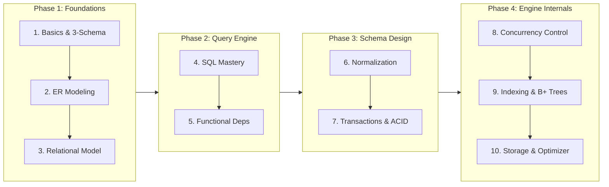

import CoreDoseLessonHeader from "@site/src/components/CoreDose/CoreDoseLessonHeader";
import CoreDoseTOC from "@site/src/components/CoreDose/CoreDoseTOC";
import Link from "@docusaurus/Link";

# Database Management Systems (DBMS)

<CoreDoseLessonHeader
  module="Course Masterclass"
  topic="Syllabus & Roadmap"
  readTime="5 min read"
  relevance="Semester Exams (All Universities) • GATE CSE • SDE Technical Interviews"
/>

<CoreDoseTOC toc={toc} />

## 🎯 Welcome to DBMS CoreDose

Welcome to the **Database Management Systems (DBMS) Complete Masterclass** on Binary Dose. 
This curriculum is built directly from authentic, battle-tested computer science notes, designed to give you **100% conceptual clarity** without academic fluff.

Whether you are preparing for:
* 🎓 **University Semester Exams** (RGPV, AKTU, VTU, SPPU, Anna Univ, etc.)
* 🚀 **GATE Computer Science (CSE)** (High-Frequency Core Subject)
* 💼 **SDE Technical Interviews** (Product & Service company rounds)

---

## 🗺️ The 10-Module Master Roadmap

---

## 📚 Complete Module Directory

### 🟢 Module 1: Basics of DBMS & Architecture (Active)
* [**1.1 What is Data & DBMS? File Systems vs Database Systems**](/coredose/dbms/chapter-01/introduction-to-dbms-and-database-systems)
* [**1.2 Three-Schema ANSI/SPARC Architecture & Data Independence**](/coredose/dbms/chapter-01/three-schema-architecture-and-data-independence)
* [**1.3 Types of Databases, DBA Roles & Data Dictionary**](/coredose/dbms/chapter-01/types-of-databases-and-dbms-architecture)

---

### 🟢 Module 2: Entity-Relationship (ER) Model (Active)
* [**2.1 Entities, Attributes & Keys: Foundations of ER Modeling**](/coredose/dbms/chapter-02/entities-attributes-and-keys)
* [**2.2 Relationship Sets, Cardinality & Participation Constraints**](/coredose/dbms/chapter-02/relationship-sets-cardinality-and-participation)
* [**2.3 Weak Entity Sets & Identifying Relationships**](/coredose/dbms/chapter-02/weak-entity-sets-and-identifying-relationships)
* [**2.4 Step-by-Step Rules: Converting ER Diagrams into Relational Tables**](/coredose/dbms/chapter-02/er-to-relational-mapping-and-table-reduction)
* [**2.5 Extended ER (EER): Specialization, Generalization, Aggregation & ER Traps**](/coredose/dbms/chapter-02/extended-er-specialization-generalization-aggregation)

---

### 🟢 Module 3: Relational Model & Relational Algebra (Active)
* [**3.1 Relational Data Model & Terminology (Tuples, Degree, Cardinality)**](/coredose/dbms/chapter-03/relational-model-concepts-and-terminology)
* [**3.2 Keys in DBMS: Super Key, Candidate Key, Primary Key & Foreign Key**](/coredose/dbms/chapter-03/keys-in-relational-model)
* [**3.3 Integrity Constraints: Domain, Entity, and Referential Integrity**](/coredose/dbms/chapter-03/integrity-constraints-and-referential-actions)
* [**3.4 Relational Algebra Operators: Selection ($\sigma$), Projection ($\pi$), Cartesian Product ($\times$), Rename ($\rho$)**](/coredose/dbms/chapter-03/fundamental-relational-algebra-operators)
* [**3.5 Relational Joins: Natural Join, Theta Join, Outer Joins (Left, Right, Full)**](/coredose/dbms/chapter-03/derived-relational-algebra-joins-and-division)

---

### 🟢 Module 4: Structured Query Language (SQL) (Active)
* [**4.1 SQL Command Categories: DDL, DML, DCL, and TCL**](/coredose/dbms/chapter-04/sql-command-categories-ddl-dml-dcl-tcl)
* [**4.2 Aggregations, GROUP BY, and HAVING Clauses**](/coredose/dbms/chapter-04/aggregations-group-by-and-having-clauses)
* [**4.3 Nested Subqueries, Correlated Subqueries & Exists**](/coredose/dbms/chapter-04/nested-subqueries-correlated-subqueries-and-exists)
* [**4.4 SQL Joins Master Guide with Visual Output**](/coredose/dbms/chapter-04/sql-joins-master-guide-with-visual-output)
* [**4.5 Window Functions, CTEs, and Views**](/coredose/dbms/chapter-04/window-functions-ctes-and-views)

---

### 🟢 Module 5: Functional Dependencies (FDs) (Active)
* [**5.1 Introduction to Functional Dependencies & Trivial vs Non-Trivial FDs**](/coredose/dbms/chapter-05/introduction-to-functional-dependencies-and-trivial-fds)
* [**5.2 Armstrong's Axioms (Inference Rules)**](/coredose/dbms/chapter-05/armstrongs-axioms-inference-rules)
* [**5.3 Attribute Closure Algorithm ($X^+$)**](/coredose/dbms/chapter-05/attribute-closure-algorithm)
* [**5.4 Algorithmic Method to Find All Candidate Keys**](/coredose/dbms/chapter-05/algorithmic-method-to-find-all-candidate-keys)
* [**5.5 Minimal / Canonical Cover of Functional Dependencies**](/coredose/dbms/chapter-05/minimal-canonical-cover-of-functional-dependencies)
* [**5.6 Equivalence of Functional Dependency Sets**](/coredose/dbms/chapter-05/equivalence-of-functional-dependency-sets)

---

### 🟢 Module 6: Database Normalization (Active)
* [**6.1 Database Anomalies: Insertion, Deletion, and Update Anomalies**](/coredose/dbms/chapter-06/database-anomalies-insertion-deletion-and-update)
* [**6.2 First Normal Form (1NF) & Second Normal Form (2NF)**](/coredose/dbms/chapter-06/first-normal-form-1nf-and-second-normal-form-2nf)
* [**6.3 Third Normal Form (3NF) vs Boyce-Codd Normal Form (BCNF)**](/coredose/dbms/chapter-06/third-normal-form-3nf-vs-bcnf)
* [**6.4 Lossless Join Decomposition Testing**](/coredose/dbms/chapter-06/lossless-join-decomposition-testing)
* [**6.5 Dependency Preserving Decomposition**](/coredose/dbms/chapter-06/dependency-preserving-decomposition)
* [**6.6 Multi-Valued Dependencies (4NF) & Join Dependencies (5NF)**](/coredose/dbms/chapter-06/multivalued-dependencies-4nf-and-join-dependencies-5nf)

---

### 🟢 Module 7: Transaction Management & ACID Properties (Active)
* [**7.1 What is a Transaction? Transaction State Life Cycle**](/coredose/dbms/chapter-07/what-is-a-transaction-and-lifecycle-states)
* [**7.2 ACID Properties Deep Dive with Banking Examples**](/coredose/dbms/chapter-07/acid-properties-deep-dive)
* [**7.3 Schedules: Serial vs Non-Serial Schedules**](/coredose/dbms/chapter-07/schedules-serial-vs-non-serial)
* [**7.4 Read-Write Conflicts and Conflict Equivalence**](/coredose/dbms/chapter-07/read-write-conflicts-and-conflict-equivalence)

---

### 🟢 Module 8: Concurrency Control & Serializability (Active)
* [**8.1 Conflict Serializability & Precedence (Serialization) Graph Testing**](/coredose/dbms/chapter-08/conflict-serializability-and-precedence-graphs)
* [**8.2 View Serializability & Blind Writes**](/coredose/dbms/chapter-08/view-serializability-and-blind-writes)
* [**8.3 Recoverability: Recoverable, Cascadeless (ACA), and Strict Schedules**](/coredose/dbms/chapter-08/recoverability-cascadeless-and-strict-schedules)
* [**8.4 Two-Phase Locking (2PL): Basic 2PL, Strict 2PL, and Rigorous 2PL**](/coredose/dbms/chapter-08/two-phase-locking-protocol-2pl)
* [**8.5 Deadlock Handling: Wait-Die vs Wound-Wait Protocols**](/coredose/dbms/chapter-08/deadlock-handling-wait-die-vs-wound-wait)
* [**8.6 Timestamp-Based Ordering Protocol & Thomas Write Rule**](/coredose/dbms/chapter-08/timestamp-ordering-and-thomas-write-rule)

---

### 🟢 Module 9: Indexing & File Organization (Active)
* [**9.1 File Organizations: Heap, Sorted, and Hash Files**](/coredose/dbms/chapter-09/file-organizations-heap-sorted-hash)
* [**9.2 Indexing Concepts: Ordered Indices (Dense vs Sparse)**](/coredose/dbms/chapter-09/ordered-indices-dense-vs-sparse)
* [**9.3 Primary Index, Clustered Index, and Secondary Index**](/coredose/dbms/chapter-09/primary-clustering-and-secondary-index)
* [**9.4 B-Trees: Structure, Node Capacity, and Searching**](/coredose/dbms/chapter-09/b-trees-structure-and-node-capacity)
* [**9.5 B+ Trees: Why Database Engines Use B+ Trees Over B-Trees**](/coredose/dbms/chapter-09/b-plus-trees-structure-and-operations)

---

### 🟢 Module 10: Advanced Topics & Storage Internals (Active)
* [**10.1 Static vs Dynamic Hashing (Extendible & Linear Hashing)**](/coredose/dbms/chapter-10/static-vs-dynamic-hashing-extendible-and-linear)
* [**10.2 Relational Calculus: Tuple Relational Calculus (TRC) & Domain Relational Calculus (DRC)**](/coredose/dbms/chapter-10/relational-calculus-trc-and-drc)
* [**10.3 Query Optimization & Query Execution Plans**](/coredose/dbms/chapter-10/query-optimization-and-cost-execution-plans)

---

## 🚀 Get Started

Ready to master DBMS from the ground up? Start with the first lesson:

👉 [**Proceed to Module 1.1: What is Data & DBMS?**](/coredose/dbms/chapter-01/introduction-to-dbms-and-database-systems)
